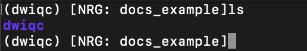
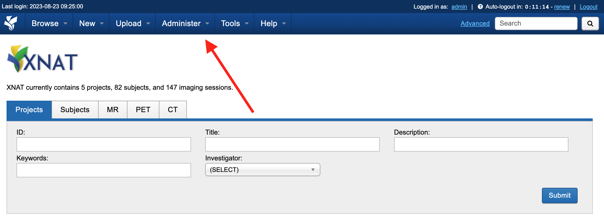
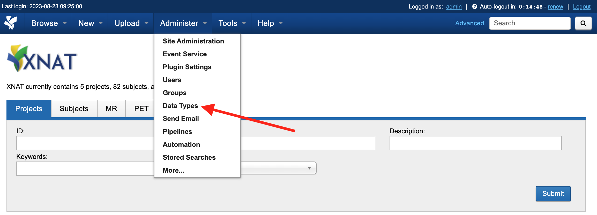
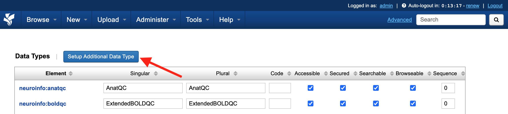
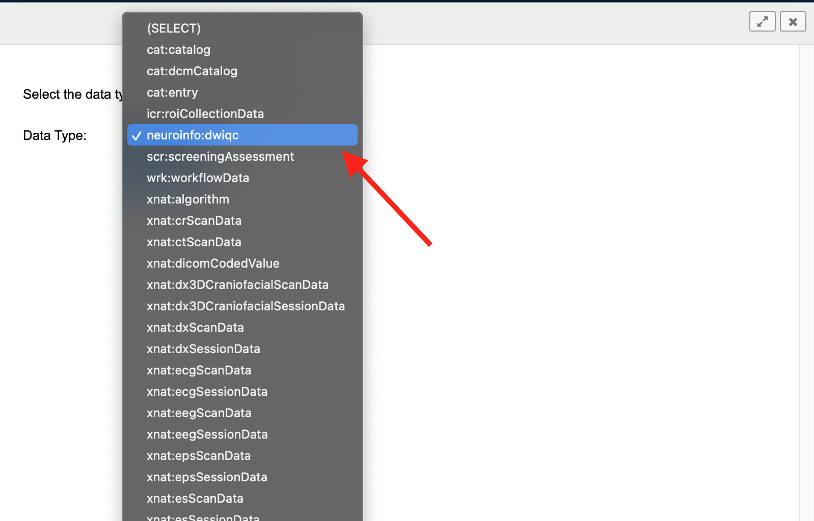
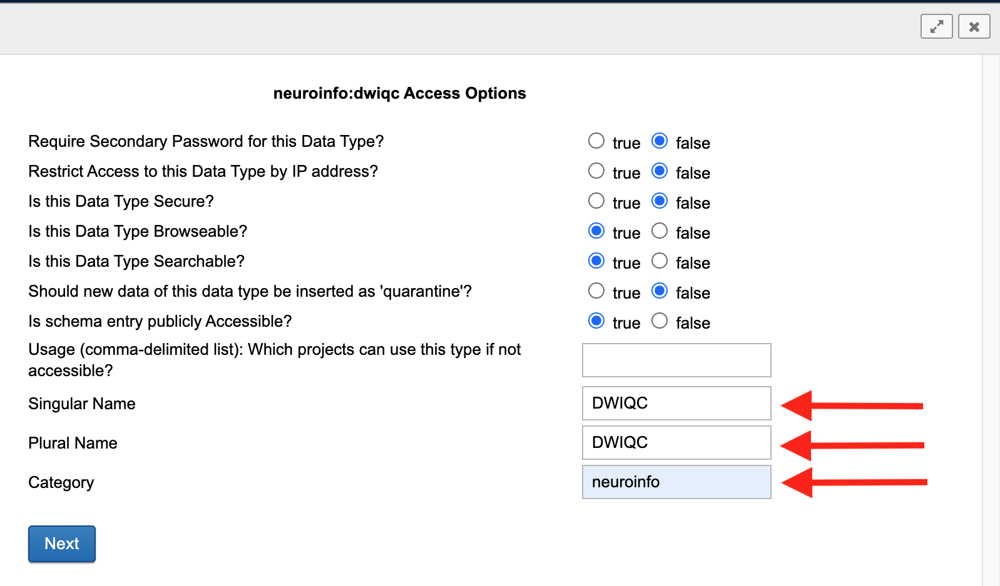

Developer Documentation
=======================
.. _XNAT: https://xnat.org
.. _Gradle: https://gradle.org/install/
.. _pip: https://pip.pypa.io/en/stable/installation/
.. _python: https://www.python.org/downloads/
.. _PyPi: https://pypi.org/project/dwiqc/
.. _prequal: https://github.com/MASILab/PreQual
.. _qsiprep: https://qsiprep.readthedocs.io/en/latest/
.. _FSL: https://fsl.fmrib.ox.ac.uk/fsl/fslwiki
.. _chromium: https://www.chromium.org/chromium-projects/

.. note::
    This documentation assumes a basic understanding of the command line. Here's a quick (and free!) crash `course <https://www.codecademy.com/learn/learn-the-command-line>`_ if needed.

HPC/Local Installation
----------------------
At the moment, the only supported way to install *DWIQC* is via "bare metal" using the `python`_ package manager `pip`_. A python version >=3.4 will come with pip preinstalled. Esnure that you have both python and pip installed on your HPC or local machine before attempting to install *DWIQC*.

Creating a Virtual Environment
^^^^^^^^^^^^^^^^^^^^^^^^^^^^^^
With python and pip installed, you can download and install *DWIQC* from `PyPi`_. You may choose to do so in a `virtual environment <https://docs.python.org/3/library/venv.html>`_. The examples here (and in other portions of the documentation) will assume that you are using a virtual environment, though it won't affect any installation or running instructions.

To create a virtual environment, named dwiqc in this example, run the following command:

.. code-block:: shell

    python3 -m venv dwiqc

Activate the virtual environment:

.. code-block:: shell

    source dwiqc/bin/activate

Your terminal window should look something like this with the name of the virtual environment in parentheses and a directory with the virtual env name.

Installing DWIQC and Dependencies
^^^^^^^^^^^^^^^^^^^^^^^^^^^^^^^^^

Install *DWIQC* from the command line using pip:

.. code-block:: shell

    pip install dwiqc

*DWIQC* will being installing along with some of its dependencies. It should only take a few moments. Run ``pip show dwiqc`` to ensure that it was installed successfully.

*DWIQC* relies on the `prequal`_, `qsiprep`_, `chromium`_, and `FSL`_ software packages so we will need to download those respective containers into your local environment. *DWIQC* uses specific and customized versions of these packages. They can be easily installed using *DWIQC*'s *install-containers* functionality. *DWIQC* will default to installing the containers at ``~/.config/dwiqc/containers``; however, the user can specify a download directory using the ``--install-location`` commmand:

.. code-block:: shell

    dwiQC.py install-containers --install-location /path/to/install/location

The containers will take 30-45 minutes to download depending on your connection speed. The containers will occupy ~30GB of storage space so pick a directory with plenty of free storage. Once the containers are downloaded, you'll be ready to `run dwiqc <xnat.html>`_!

XNAT Installation
-----------------
The following section will describe how to build and configure *DWIQC* as an `XNAT`_ plugin.

Building the Plugin
^^^^^^^^^^^^^^^^^^^
Clone the ``xnat-1.8`` branch from the ``github.com/harvard-nrg/dwiqc`` 
repository ::

    git clone -b xnat-1.8 --single-branch https://github.com/harvard-nrg/dwiqc

Change into the repository directory and compile the plugin using `Gradle`_ ::

    ./gradlew jar

Once the plugin has been compiled, move the resulting ``.jar`` into your XNAT plugins directory ::

    mv ./build/libs/dwiqc-plugin-1.0.0.jar ${XNAT_HOME}/plugins/

Configuring Nginx
^^^^^^^^^^^^^^^^^
You will have to do a little bit of extra configuration in the ``nginx.conf`` file on the XNAT server. Without this configuration, XNAT will start downloading all of the DWIQC reports to your local machine and you won't be able to view them on the browser. Here's a way around that!

First, navigate to your ``nginx`` directory. This might be located at ``/etc/nginx`` if you're running XNAT on "bare metal" or under your ``xnat-docker-compose`` directory if you're using that to run your XNAT. Once you're there, cd into the ``conf.d`` directory and open up the server config file using your favorite text editor. ``xnat-docker-compose`` users may have a file named ``nginx.conf``. 

Your ``nginx.conf`` file may look something like this:

.. code-block:: yaml

    #user www-data;
    worker_processes auto;
    #pid /run/nginx.pid;
    events {
      worker_connections 1024;
      # multi_accept on;
    }
    http {
      ##
      # Basic Settings
      ##
      sendfile on;
      tcp_nopush on;
      tcp_nodelay on;
      keepalive_timeout 100;
      types_hash_max_size 2048;
      # server_tokens off;
      # server_names_hash_bucket_size 64;
      # server_name_in_redirect off;
      include /etc/nginx/mime.types;
      default_type application/octet-stream;
      ##
      # SSL Settings
      ##
      #ssl_protocols TLSv1 TLSv1.1 TLSv1.2; # Dropping SSLv3, ref: POODLE
      #ssl_prefer_server_ciphers on;
      ##
      # Logging Settings
      ##
      access_log /var/log/nginx/access.log;
      error_log /var/log/nginx/error.log;
      ##
      # Gzip Settings
      ##
      gzip on;
      gzip_disable "msie6";
      # gzip_vary on;
      # gzip_proxied any;
      # gzip_comp_level 6;
      # gzip_buffers 16 8k;
      # gzip_http_version 1.1;
      # gzip_types text/plain text/css application/json application/javascript text/xml application/xml application/xml+rss text/javascript;
      ##
      # Virtual Host Configs
      ##
      #include /etc/nginx/conf.d/*.conf;
      #include /etc/nginx/sites-enabled/*;
      server {
        listen 80;
        return                301 https://cbscentral02.rc.fas.harvard.edu$request_uri;
      } 

      server {
        listen 443 ssl;
        ssl_certificate       /etc/pki/tls/cbscentral02_rc_fas_harvard_edu.crt;
        ssl_certificate_key   /etc/pki/tls/cbscentral02_rc_fas_harvard_edu.key;
        location / {
            proxy_pass                          http://xnat-web:8080;
            proxy_redirect                      http://xnat-web:8080 $scheme://localhost;
            proxy_set_header Host               $host;
            proxy_set_header X-Real-IP          $remote_addr;
            proxy_set_header X-Forwarded-Host   $host;
            proxy_set_header X-Forwarded-Server $host;
            proxy_set_header X-Forwarded-For    $proxy_add_x_forwarded_for;
            proxy_connect_timeout               150;
            proxy_send_timeout                  100;
            proxy_read_timeout                  100;
            proxy_buffers                       8 4k;
            proxy_max_temp_file_size            2048m;
            client_max_body_size                0;
            client_body_buffer_size             128k;
            # Don't download pdf reports when imbedded in an iframe
            location ~ /data.*\.pdf$ {
              proxy_pass http://xnat-web:8080;
              proxy_hide_header Content-Disposition;
            }
            # Don't download qsiprep html report when imbedded in an iframe
            location ~ /data.*qsiprep\.html$ {
              proxy_pass http://xnat-web:8080;
              proxy_hide_header Content-Disposition;
            }
            # Don't download svg files when imbedded in an iframe
            location ~ /data.*\.svg$ {
              proxy_pass http://xnat-web:8080;
              proxy_hide_header Content-Disposition;
            }
        }
        access_log /var/log/nginx/xnat.access.log;
        error_log /var/log/nginx/xnat.error.log;
    }
    }

This is a bit overwhelming but the part to focus on is at the bottom starting with the comment that says `Don't download pdf reports when imbedded in an iframe`. Copy and paste all three ``location`` blocks so that XNAT doesn't automatically download the pdf files, qsiprep.html and the svg files. So just this section:

.. code-block:: yaml

    # Don't download pdf reports when imbedded in an iframe
    location ~ /data.*\.pdf$ {
      proxy_pass http://xnat-web:8080;
      proxy_hide_header Content-Disposition;
    }
    # Don't download qsiprep html report when imbedded in an iframe
    location ~ /data.*qsiprep\.html$ {
      proxy_pass http://xnat-web:8080;
      proxy_hide_header Content-Disposition;
    }
    # Don't download svg files when imbedded in an iframe
    location ~ /data.*\.svg$ {
      proxy_pass http://xnat-web:8080;
      proxy_hide_header Content-Disposition;
    }

With that added to the ``nginx.conf`` file, you're ready to activate your plugin!

.. note::

    If tomcat is running or the docker containers are running when you make this change you will have to restart them!

Activating the Plugin
^^^^^^^^^^^^^^^^^^^^^
There are several necessary steps to activate the *DWIQC* plugin via your XNAT instance's home page. First, login and click on the *Administer* button at the top:

Next, click on *Data Types*:

Click on *Setup Additional Data Type*:

You will see a drop down menu. Select *neuroinfo:dwiqc* and click *Submit*.

You can leave all of the True/False statements as they are in this window (unless you have a reason to change them). Fill in the boxes labeled *Singular Name*, *Plural Name*, and *Category* with the information shown below and click *Next*. 

Click *Next* through the remainder of the windows without editing anything, and Voila! *DWIQC* is now configured on your XNAT instance.
