XNAT User Documentation
=======================
.. _XNAT: https://doi.org/10.1385/NI:5:1:11
.. _command.json: https://github.com/harvard-nrg/anatqc/blob/xnat-1.7.6/command.json
.. _T1w: https://tinyurl.com/hhru8ytz
.. _prequal: https://github.com/MASILab/PreQual
.. _qsiprep: https://qsiprep.readthedocs.io/en/latest/
.. _installation: developers.html#hpc-installation
.. _FreeSurfer: https://surfer.nmr.mgh.harvard.edu/fswiki/DownloadAndInstall

Tagging your scans
------------------
For DWIQC to discover Diffusion and Fieldmap scans to process, you need to add notes to those scans in `XNAT`_. This can either be done via the XNAT interface or through the `xnattagger <https://github.com/harvard-nrg/xnattagger>`_ command line tool. To tag via the XNAT interface, you can add notes using the ``Edit`` button located within the ``Actions`` box on the MR Session report page.

========= ================================  ===========================================================
Type      Example series                    Note
========= ================================  ===========================================================
DWI       ``UKbioDiff_ABCDseq_ABCDdvs``     ``#DWI_MAIN_001, #DWI_MAIN_002, ..., #DWI_MAIN_N``
PA_FMAP   ``UKbioDiff_ABCDseq_DistMap_PA``  ``#DWI_PA_001, #DWI_PA_002, ..., #DWI_PA_N``
AP_FMAP   ``UKbioDiff_ABCDseq_DistMap_AP``  ``#DWI_AP_001, #DWI_AP_002, ..., #DWI_AP_N``
========= ================================  ===========================================================

The image below displays an MR Session report page with populated notes.

.. note::
   Note that if a ``DWI`` scan has corresponding ``PA`` and ``AP`` scans, they should be assigned matching numbers. For example, ``#DWI_MAIN_001`` would correspond to ``#DWI_PA_001`` and ``#DWI_AP_001``.

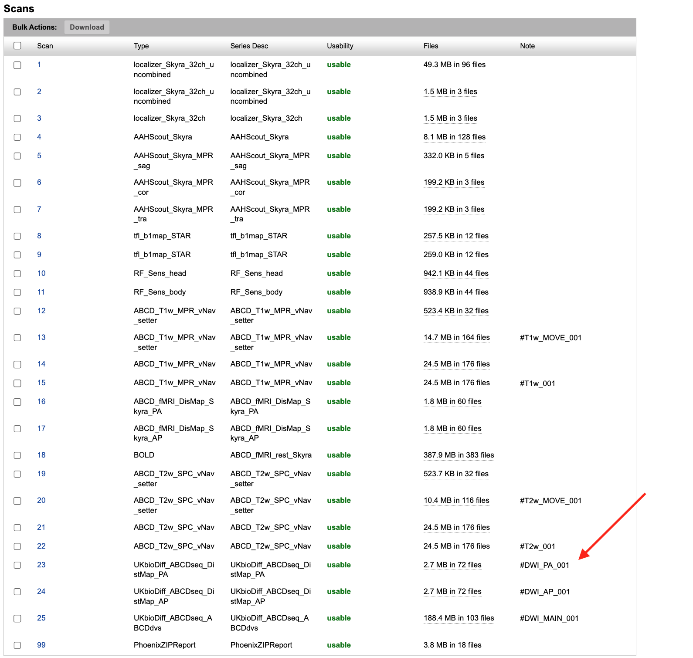

xnattagger
------------
xnattagger automates the process of tagging scans in your XNAT project. xnattagger runs by default in the *get* and *tandem* modes of dwiqc. The default tagging convention is the same as seen here (and above), but can be configured to user specifications. Please see the `xnattagger documentation <xnattagger.html>`_ for details. 

================= =======
DWI scan          run
================= =======
``#DWI_MAIN_001`` 1
``#DWI_MAIN_002`` 2
``#DWI_MAIN_999`` 999
================= =======

Running the pipeline
--------------------
For the time being, DWIQC can only be run outside of XNAT on a High Performance Computing system. Please see developer documentation for `installation`_ details.

Overview
^^^^^^^^^
With DWIQC and it's necessary containers installed, you're ready to analyze some diffusion data! Let's start by giving you a broad idea of what DWIQC does. 

DWIQC was designed with the goal of speeding up the quality check workflow of diffusion weighted imaging data. Ideally, DWIQC would be run on subjects while the study is ongoing and as to help researchers catch problems (excessive motion, acquisition issues, etc.) as they happen, rather than discovering them after the data has been collected and the problems cannot be rectified. That being said, running DWIQC on previously acquired data can certainly provide helpful information. 

DWIQC is built on the `prequal`_ and `qsiprep`_ processing packages. Both of these tools are excellent in their own right. We found that by running both of them, we can maximize our understanding of the data quality and glean additional insights. DWIQC was built completely in python and we welcome anyone to peruse the `codebase <https://github.com/harvard-nrg/dwiqc>`_ and make build suggestions (hello, pull requests!)

get, process and tandem modes
^^^^^^^^^^^^^^^^^^^^^^^^^^^^^^
DWIQC is broken down into four different "modes". As you saw in the `installation`_ section, the *install-containers* mode is used upon initial setup of your DWIQC environment. *get*, *process* and *tandem* modes are used once everything has been properly installed and you're ready to start working with the data. We'll start by looking at *get* mode.

.. note::
        The following sections assume you've activated your python virtual environment as demonstrated in the `installation`_ section. Shown again here:

.. code-block:: shell

    source dwqic/bin/activate

get mode
^^^^^^^^
.. note::
    *get* mode is only applicable if you have an XNAT instance you're going to interact with. If you're only going to use DWIQC outside of XNAT, please feel free to skip to the `process <#process-mode>`_ mode section. 

**Overview**

*get* mode functions as a way to download data from XNAT to your local compute environment. *get* mode's primary feature is the ability to download data and convert it to BIDS format. If you're unfamiliar with BIDS, read up on it `here <https://bids-specification.readthedocs.io/en/stable/>`_. Note that `dcm2niix <https://www.nitrc.org/plugins/mwiki/index.php/dcm2nii:MainPage#General_Usage>`_ must be installed and on your path or loaded via ``module load``. *get* mode will fail without it.

Before using *get* mode, I strongly recommend creating an `xnat_auth alias <https://yaxil.readthedocs.io/en/latest/xnat_auth.html>`_ using the excellent `yaxil <https://yaxil.readthedocs.io/en/latest/>`_ python library. It's not stictly necessary to do so, but it will make your life easier. Example code will use an xnat alias. If you've already `installed <developers.html#hpc-installation>`_ DWIQC, yaxil will have been installed as well (yaxil is a DWIQC dependency). 

**Required Arguments**

*get* mode requires three arguments: `1) ---label` `2) ---bids-dir` `3) ---xnat-alias`

1. ``--label`` refers to the XNAT MR Session ID, which is found under XNAT PROJECT ---> SUBJECT ---> MR_SESSION

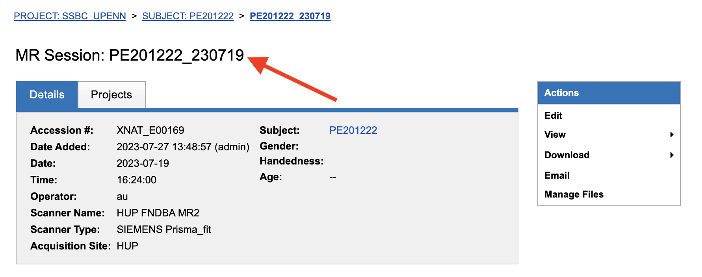

2. ``--bids-dir`` should be the **absolute** path to the desired download directory. If the directory doesn't exist, it will be created.

.. code-block:: shell

    /usr/home/username/project_data/MR_Session

``cd`` into the desired directory and execute ``pwd`` to get a directory's absolute path.

3. ``--xnat-alias`` is the alias containing credentials associated with your XNAT project. It can be created `here <https://yaxil.readthedocs.io/en/latest/xnat_auth.html>`_.

**Executing the Command**

Command Template:

.. code-block:: shell

    dwiQC.py get --label <MR_SESSION> --bids-dir <PATH_TO_BIDS_DIR> --xnat-alias <ALIAS>

Command Example:

.. code-block:: shell

    dwiQC.py get --label PE201222_230719 --bids-dir /users/nrg/PE201222_230719 --xnat-alias ssbc

.. note::
    Ensure that every MR_Session has its own dedicated BIDS download directory. If not, DWIQC will not run properly. 

**Expected Output**

After running DWIQC *get* you should see two new directories and one new file under your BIDS dir, similar to what's shown here:

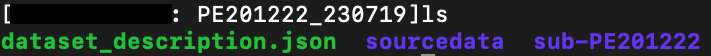

*dataset_description.json* conatains very basic information about the downloaded data. It's required by BIDS format. *sourcedata* contains the raw dicoms of all the downloaded scans. *sub-PE201222* (will differ for you) contains the downloaded data in proper BIDS format. If you enter the directory, you should see the subject session, then three more directories: *anat*, *dwi* and *fmap*. Those directories contain the MR Session's respective anatomical, diffusion and diffusion field map data. If one of the directories is missing or empty, verify that your session's scans have been tagged correctly and that the data is downloadable.

**Common Errors**

The most common *get* mode error stems from DWIQC being unable to locate and use dcm2niix. Make sure it's on your path! 

**Advanced Usage**

There are a few *get* mode optional arguments that are worth noting. 

| 1. By default, *get* mode will run `xnattagger <xnattagger.html>`_ on the provided MR Session. If you'd like to turn off that functionality, simply pass the ``--no-tagger`` argument.

| 2. Related to xnattagger is the `--xnat-config` argument. This argument refers to a config file found `here <https://github.com/harvard-nrg/dwiqc/blob/main/dwiqc/config/dwiqc.yaml>`_ which DWIQC uses to find the appropriately tagged scans in your XNAT project. The config file, written in the yaml format, uses regular expressions (regex) to find the desired scans. The expressions used in the default config file follow the convention depicted `above <#tagging-your-scans>`_. If your scans are tagged using a different convention, create a yaml file similar in structure to the example given here and pass it to ``--xnat-config`` in *get* mode. 
 
| 3. If you would like to see what data will be downloaded from XNAT without actually downloading it, pass the ``--dry-run`` argument. You will also have to specify an output json file: ``-o test.json``. That json file will contain metadata about the scans *get* mode would download. This can be useful for testing.

**All Arguments**

==================== ========================================  ========
Argument             Description                                Required
==================== ========================================  ========
``--label``          XNAT Session Label                        Yes
``--bids-dir``       Path to BIDS download directory           Yes
``--xnat-alias``     Alias for XNAT Project                    Yes
``--project``        Project Name                              No
``--xnat-config``    Configuration file for downloading scans  No
``--no-tagger``      Turn off *xnattagger*                     No
``--dry-run``        Generate list of to-be-downloaded scans   No
``-o``               Path to ``--dry-run`` json output file    No
==================== ========================================  ========

process mode
^^^^^^^^^^^^
**Overview**

With your data successfully downloaded using *get* mode (or organized in BIDS format through other means) you are ready to run DWIQC. We recommended running DWIQC in an HPC (High Performance Computing) environment rather than on a local machine. By default, DWIQC will run both `prequal`_ and `qsiprep`_ using gpu compute nodes. However, it is possible to turn off gpu-dependent features by using the ``--no-gpu`` argument. DWIQC may require up to 20GB of RAM if run on a local/non-gpu machine so please allocate resources appropriately. 

**Required Arguments**

*process* mode requires 5 arguments:

`1) ---sub` `2) ---ses` `3) ---bids-dir` `4) ---partition` `5) ---fs-license`

| 1. ``--sub`` is the subject's identifier in the BIDS hierarchy. If you've used *get* mode to download your data it will be in the ``--bids-dir`` directory. In the case of the example we're using here, it would be PE201222. Remember not to include the "sub-"" prefix! 

| 2. ``--ses`` is the specific session for your subject according to BIDS format. By default, get mode will place a session direcory one step below the sub-SUBJECT directory and combine the subject and session identifier from XNAT. The example above downloaded data under the XNAT label PE201222_230719, so the session directory will be called ses-PE201222230719. See example below. *get* mode will remove any non alpha-numeric characters in the ``--label`` argument when creating the session name.
 
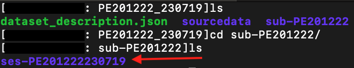

| 3. ``--bids-dir`` is the same directory passed to the ``bids-dir`` argument in *get* mode.

| 4. ``--partition`` refers to the name of the partition or cluster where the sbatch jobs will be submitted to. This is generally just the name of your HPC system (e.g. fasse, fasse_gpu, Armis, etc.) 

| 5. ``--fs-license`` should be the **absolute** path to the FreeSurfer license file in your environment. You can obtain a license by downloading `FreeSurfer`_.

**Executing the Command**

Command Template:

.. code-block:: shell

    dwiQC.py process --sub <bids_subject> --ses <bids_session> --bids-dir <path_to_bids_dir> --partition <HPC_name> --fs-license <path_to_freesurfer_license>

Command Example:

.. code-block:: shell

    dwiQC.py process --sub PE201222 --ses PE201222230719 --bids-dir /users/nrg/PE201222_230719 --partition fasse_gpu --fs-license /home/apps/freesurfer/license.txt

**Expected Output**

DWIQC runtime varies based on available resources, size of data and desired processing steps. Users should expect one session to take 3-5 hours to complete prequal and 7-10 hours to complete qsiprep. Prequal and qsiprep are run in parallel, so total processing time rarely exceeds 10 hours. DWIQC also makes use of the FSL tool eddy quad. Eddy quad runs a series of quality assesment commands to generate images and quantitative metric tables. Eddy quad doesn't take more than 10 minutes to run in most cases. A successful DWIQC run will contain output from all three of these software packages. 

Prequal Output:

To find the prequal pdf report, navigate to the ``--bids-dir`` directory you passed to *process* mode. The pdf will be located under several layers of directories:

derivatives ---> dwiqc-prequal ---> subject_dir ---> session_dir ---> sub_session_dir_run__dwi ---> OUTPUTS ---> PDF ---> dtiQA.pdf

Download an example :download:`here <examples/dtiQA.pdf>`.

Qsiprep Output:

To find the qsiprep html report, navigate to the ``--bids-dir`` directory you passed to *process* mode. The html file will be located under several layers of directories:

derivatives ---> dwiqc-qsiprep ---> subject_dir ---> session_dir ---> sub_session_dir_run__dwi ---> qsiprep_output ---> qsiprep ---> sub-SUBJECT-imbedded_images.html

Download an example :download:`here <examples/sub-MS881355-imbedded_images.html>`.

Eddy Quad Output:

To find the eddy quad pdf report, navigate to the ``--bids-dir`` directory you passed to *process* mode. The pdf file will be located under several layers of directories:

derivatives ---> dwiqc-prequal ---> subject_dir ---> session_dir ---> sub_session_dir_run__dwi ---> OUTPUTS ---> EDDY ---> SUBJECT_SESSION.qc ---> qc.pdf

Download an example :download:`here <examples/qc.pdf>`.

**Common Errors**

A somewhat common error (affects about 5% of subjects) is an Eddy Volume to Volume registration that looks something like this:

.. image:: images/eddy-error.png

This error means that the FSL tool ``eddy``, which both prequal and qsiprep use in their pipelines, could not find any volumes within a specific shell that did not have intensity outliers. There are three different approaches to solving this problem that have their respective implications: 

| 1. Exclude that session from the larger dataset. This approach ensures that all data meet the same standard of stringency. 

| 2. Change what FSL considers to be an outlier. By default, DWIQC tells FSL that an outlier is anything more than 5 standard deviations from the mean. The user could change that to 6 standard deviations, which would increase the liklihood of running eddy successfully while keeping the same standard for all data. 

| 3. Change the number of standard deviations to 6 only for the subjects that are being affected. The theoretical implications of this approach (or any others) are not explored in depth here and it is left to the user to make informed decisions.

.. note:: 
    This error generally only occurs in qsiprep.

To adjust the number of standard deviations, edit a file in your ``--bids-dir`` called ``eddy_params_s2v_mbs.json`` that was created when you first ran DWIQC. Open the file and change the argument that says ``--ol_nstd=5`` to ``--ol_nstd=6``. Simply running DWIQC again will overwrite the ``eddy_params_s2v_mbs.json`` you just edited, so pass the ``--custom-eddy`` argument to DWIQC with the path to the newly edited ``eddy_params_s2v_mbs.json`` file.

.. code-block:: shell

    dwiQC.py process --sub PE201222 --ses PE201222230719 --bids-dir /users/nrg/PE201222_230719 --partition fasse_gpu --fs-license /home/apps/freesurfer/license.txt --custom-eddy /users/nrg/PE201222_230719/eddy_params_s2v_mbs.json

**Advanced Usage**

Only a few of the many possible *process* mode arguments will be discussed here. 

| 1. ``--qsiprep-config`` and ``--prequal-config`` allow you to customize the arguments passed to qsiprep and prequal. By default, these are the `qsiprep config <https://github.com/harvard-nrg/dwiqc/blob/main/dwiqc/config/qsiprep.yaml>`_ and `prequal config <https://github.com/harvard-nrg/dwiqc/blob/main/dwiqc/config/prequal.yaml>`_ arguments being passed. Using these config files as a template, you can customize your prequal and qsiprep commands. Example usage: ``--prequal-config /users/nrg/PE201222_230719/prequal.yaml``

| 2. ``--xnat-upload`` indicates that the output from DWIQC should be uploaded to your XNAT project. ``--xnat-alias`` (see *get* mode) must be passed for this argument to work. Example usage: ``--xnat-upload`` (just passing the argument is sufficient)

| 3. ``--output-resolution`` allows you to specify the resolution of images created by qsiprep. The default is the same as the input data. Example usage: ``--output-resolution 1.0``

| 4. ``--no-gpu`` enables users without access to a gpu node to run DWIQC. Note that some advanced process features are not available without gpu computing. Example usage: ``--no-gpu`` (just passing the argument is sufficient)

| 5. ``--sub-tasks`` is used to run either just qsiprep or prequal. Example usage: ``--sub-tasks qsiprep``

| 6. ``--custom-eddy`` is used to pass custom FSL eddy parameters to qsiprep as noted under *Common Errors*. Example usage: ``--custom-eddy /users/nrg/PE201222_230719/eddy_params_s2v_mbs.json``

**All Arguments**

Fill in with box of all possible arguments for *process*.

tandem mode
^^^^^^^^^^^

**Overview**

**Required Arguments**

**Executing the Command**

**Command Template**

**Expected Output**

**Common Errors**

**Advanced Usage**

Understanding the Report Page
-----------------------------

Left pane
^^^^^^^^^
The left pane is broken up into several distinct sections. Each section will be described below.

Summary
"""""""
The ``Summary`` pane orients the user to what MR Session they're currently looking at and various processing details.

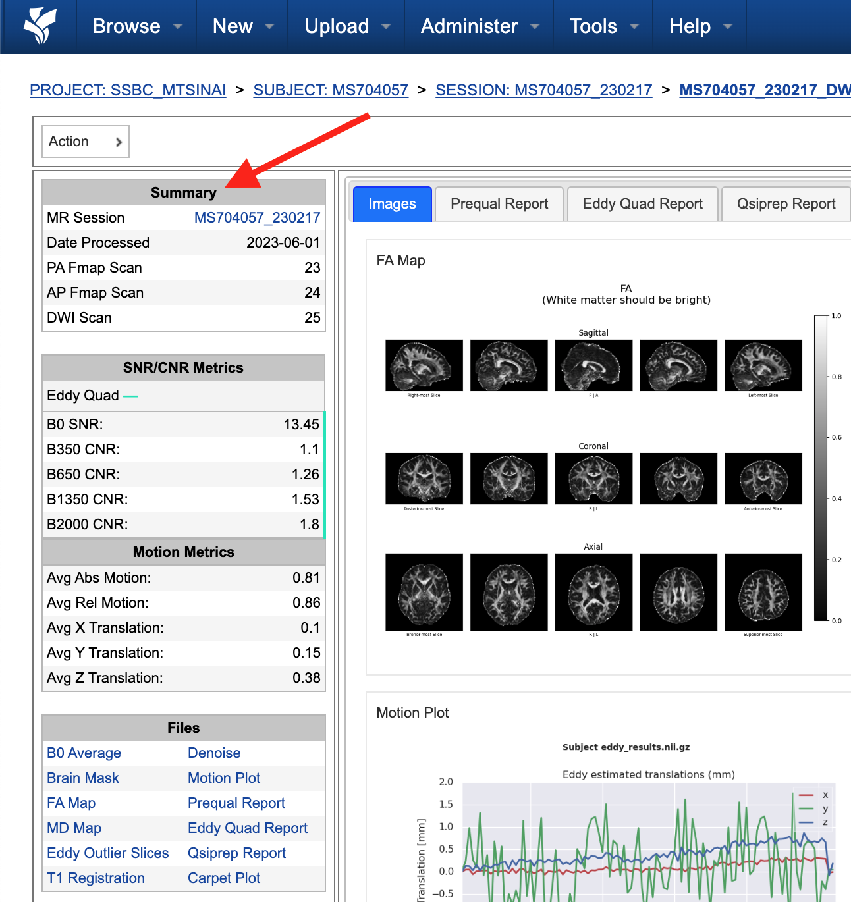

============== ==================================
Key            Description
============== ==================================
MR Session     MR Session label
Date Processed Processing date
PA Fmap Scan   PA Fieldmap used
AP Fmap Scan   AP Fieldmap used
DWI Scan       DWI scan used
============== ==================================

SNR/CNR Metrics
"""""""""""""""
The ``SNR/CNR Metrics`` pane displays SNR/CNR metrics computed *for each individual shell*.

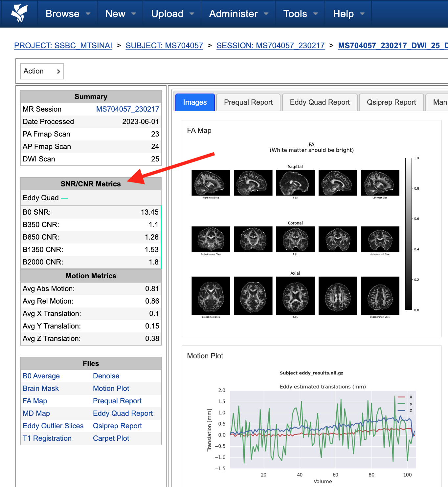

=========== ======================= =================================================
Metric      From                    Description                              
=========== ======================= =================================================
B0 SNR      Eddy Quad (Prequal/FSL) Signal-to-noise ratio for B0 Shell
BN CNR      Eddy Quad (Prequal/FSL) Contrast-to-noise ratio for each shell
=========== ======================= =================================================

.. note::
      Anywhere you see "Eddy Quad (Prequal/FSL)" means that FSL's Eddy Quad tool was run on Prequal output.

Motion Metrics
""""""""""""""
The ``Motion Metrics`` pane displays motion metrics computed over dwi scan(s).

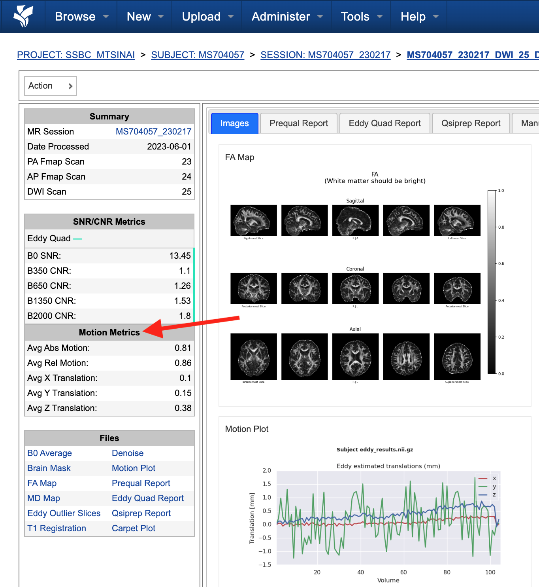

================= ======================= ===========================================================
Metric            From                    Description
================= ======================= ===========================================================
Avg Abs Motion    Eddy Quad (Prequal/FSL) Estimated amount of all motion in any direction
Avg Rel Motion    Eddy Quad (Prequal/FSL) Estimated motion relative to initial head position
Avg X Translation Eddy Quad (Prequal/FSL) Estimated X translation motion
Avg Y Translation Eddy Quad (Prequal/FSL) Estimated Y translation motion
Avg Z Translation Eddy Quad (Prequal/FSL) Estimated Z translation motion
================= ======================= ===========================================================

Files
"""""
The ``Files`` pane contains the most commonly requested files. Clicking on any of these files will display that file in the browser.

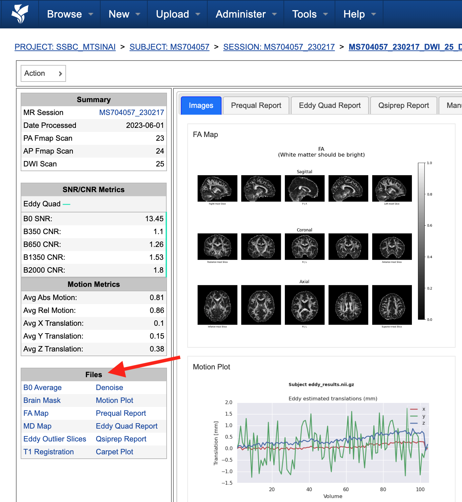

======================= ======================= ======================================================
File                    From                    Description
======================= ======================= ======================================================
B0 Average              Eddy Quad (Prequal/FSL) BO Shell Average Image
Brain Mask              Qsiprep                 Gray Matter, White Matter and Pial Boundaries
FA Map                  Prequal                 Fractional Anisotropy Map
MD Map                  Prequal                 Mean Diffusivity Map
Eddy Outlier Sices      Prequal                 Plot of Slices with Motion Outliers
T1 Registration         Qsiprep                 GIF of T1w image to Template Registration
Denoise                 Qsiprep                 GIF of DWI Image Pre and Post Denoising
Motion Plot             Eddy Quad (Prequal/FSL) Translational and rotational motion, displacement
Prequal Report          Prequal                 Prequal PDF Report
Eddy Quad Report        Eddy Quad (Prequal/FSL) Eddy Quad PDF Report
Qsiprep Report          Qsiprep                 Qsiprep HTML Report
Carpet Plot             Qsiprep                 Maximum Framewise Displacement Plot
======================= ======================= ======================================================

.. note:: 
      Clicking on any of the ``Report`` files will open the complete report in a new tab in your browser for viewing. You can also download them from the new tab.

Tabs
^^^^
To the right of the `left pane <#left-pane>`_ you'll find a tab container. The following section explains the contents of each tab.

Images
""""""
The ``Images`` tab displays a zoomed out view of the FA and MD image maps, motion plots, brain mask, motion outlier slices, average shell images and a maximum framewise displacement plot.

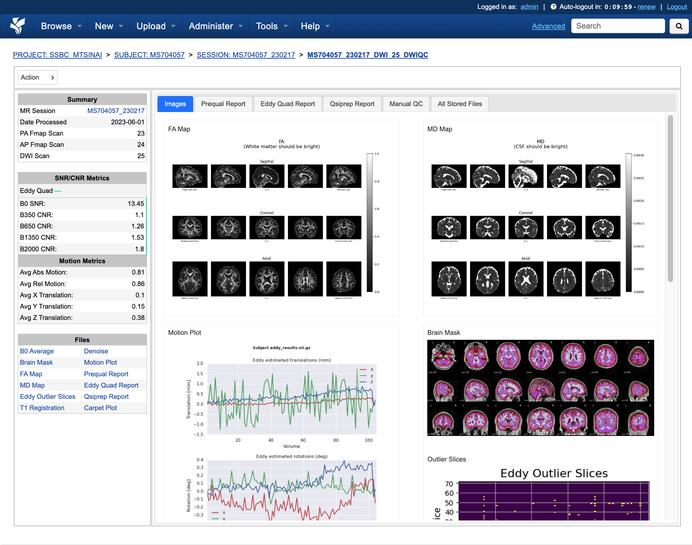

Clicking on an image within the ``Images`` tab will display a larger version of that image in the browser.

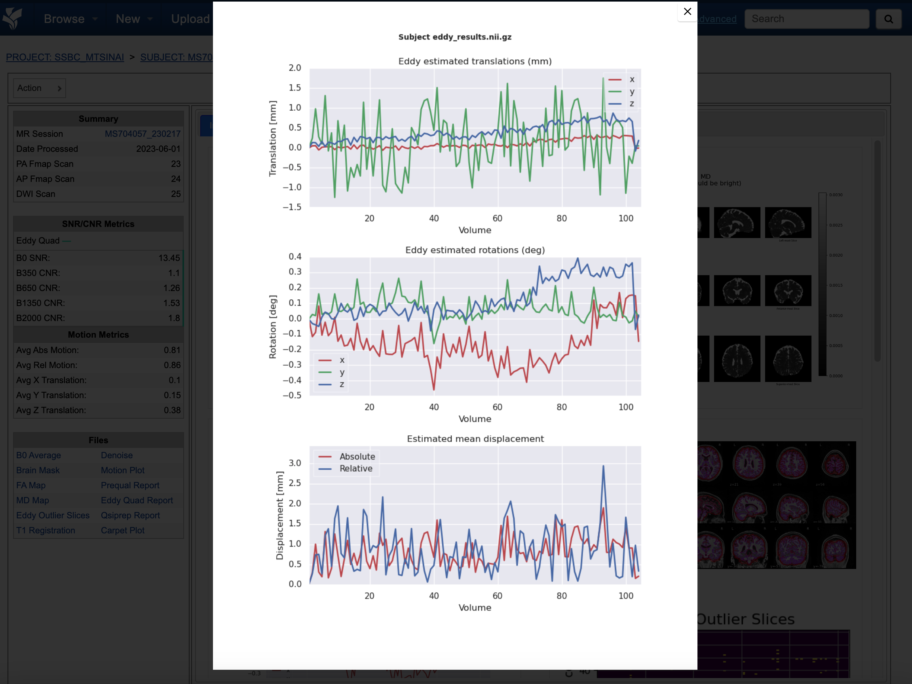

Prequal Report tab
""""""""""""""""""
The ``Prequal Report`` tab displays the complete Prequal PDF report.

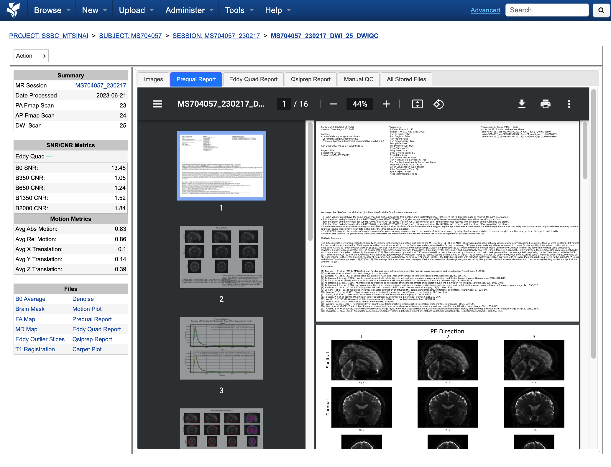

Eddy Quad Report Tab
""""""""""""""""""""
The ``Eddy Quad Report`` tab displays key metrics and figures from the FSL Eddy command. 

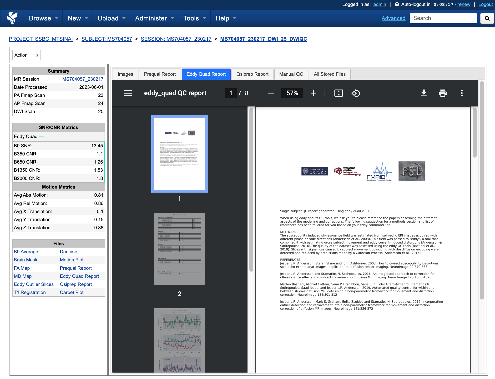

Qsiprep Report Tab
""""""""""""""""""
The ``Qsiprep Report`` tab displays the complete Qsiprep HTML report.

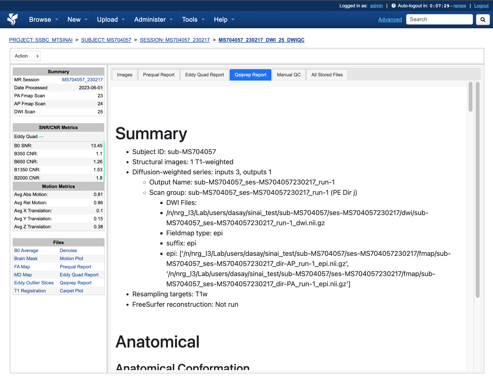

All Stored Files
""""""""""""""""
The ``All Stored Files`` tab contains a list of *every file* stored by DWIQC.

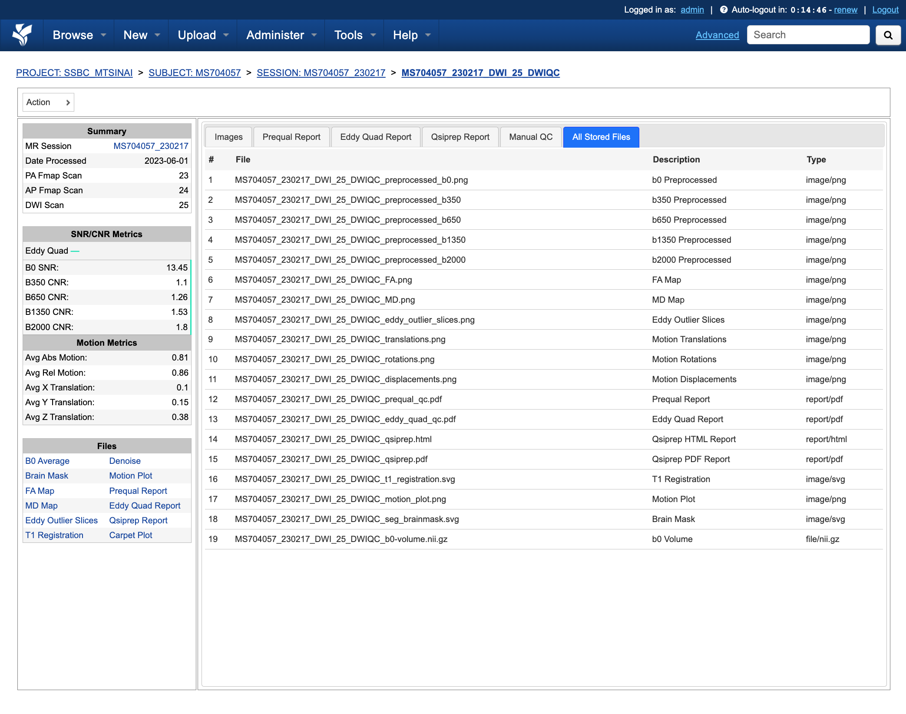

.. note::
   Clicking on a file within the ``All Stored Files`` tab will download that file.

================================= =================================================
File                              Description
================================= =================================================
B0 Image                          B0 Volume/Shell
BN Images                         Images from Each Shell
FA Map                            Fractional Anisotropy Map
MD Map                            Mead Diffusivity Map
Eddy Outlier Slices               Plot of Slices with Motion Outliers
Motion Translations               Plot of motion translations across DWI scan
Motion Rotations                  Plot of motion rorations acorss DWI scan
Motion Displacements              Plot of motion displacements across DWI scan
Prequal PDF Report                Complete Prequal Report
Eddy Quad PDF Report              Complete Eddy Quad Report (run on Prequal output)
Qsiprep HTML Report               Complete Qsiprep Report in HTML Format
Qsiprep PDF Report                Complete Qsiprep Report in PDF Format
T1 Registration                   GIF of T1w image to Template Registration
Complete Motion Plot              Motion plot including transl, rot, displacements
Brain Mask/Segmentations          Gray Matter/White Matter Segmentations and Mask
B0 Volume                         B0 Volume from DWI Scan
================================= =================================================
