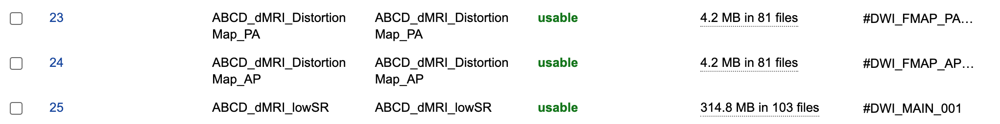
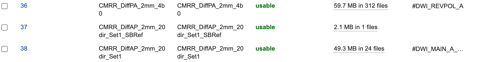

User Documentation
=======================
.. _XNAT: https://doi.org/10.1385/NI:5:1:11
.. _T1w: https://tinyurl.com/hhru8ytz
.. _prequal: https://github.com/MASILab/PreQual
.. _qsiprep: https://qsiprep.readthedocs.io/en/latest/
.. _installation: developers.html#hpc-installation
.. _FreeSurfer: https://surfer.nmr.mgh.harvard.edu/fswiki/DownloadAndInstall

.. note::
    This documentation assumes a basic understanding of the command line. Here's a quick (and free!) crash `course <https://www.codecademy.com/learn/learn-the-command-line>`_ if needed.

Tagging your scans
------------------
For *DWIQC* to discover diffusion and fieldmap scans to process, you need to add notes to those scans in `XNAT`_. This can either be done via the XNAT interface or through the xnattagger `command line tool <xnattagger.html>`_. To tag via the XNAT interface, you can add notes using the ``Edit`` button located within the ``Actions`` box on the MR Session report page.

========= ================================  ===========================================================
Type      Example series                    Note
========= ================================  ===========================================================
DWI       ``UKbioDiff_ABCDseq_ABCDdvs``     ``#DWI_MAIN_001, #DWI_MAIN_002, ..., #DWI_MAIN_N``
PA_FMAP   ``UKbioDiff_ABCDseq_DistMap_PA``  ``#DWI_FMAP_PA_001, #DWI_FMAP_PA_002, ..., #DWI_FMAP_PA_N``
AP_FMAP   ``UKbioDiff_ABCDseq_DistMap_AP``  ``#DWI_FMAP_AP_001, #DWI_FMAP_AP_002, ..., #DWI_FMAP_AP_N``
========= ================================  ===========================================================

The image below displays an MR Session report page with populated notes.

.. note::
   Note that if a ``DWI`` scan has corresponding ``PA`` and ``AP`` scans, they should be assigned matching numbers. For example, ``#DWI_MAIN_001`` would correspond to ``#DWI_FMAP_PA_001`` and ``#DWI_FMAP_AP_001``.

.. image:: images/xnat-scan-notes.png

xnattagger
------------
xnattagger automates the process of tagging scans in your XNAT project. xnattagger can optionally be run in the *get* and *tandem* modes of *DWIQC* using the ``--run-tagger`` argument. The default tagging convention is the same as seen here (and above), but can be configured to user specifications. Please see the `xnattagger documentation <xnattagger.html>`_ for details. 

================= =======
DWI scan          run
================= =======
``#DWI_MAIN_001`` 1
``#DWI_MAIN_002`` 2
``#DWI_MAIN_999`` 999
================= =======

Running the pipeline
--------------------
For the time being, *DWIQC* can only be run outside of XNAT on a High Performance Computing system with access to gpu nodes (or a local gpu node). Please see the developer documentation for `installation`_ details before proceeding.

Overview
^^^^^^^^^
With *DWIQC* and it's necessary containers installed, you're ready to analyze some diffusion data! Let's start by giving you a broad idea of what *DWIQC* does. 

*DWIQC* was designed with the goal of speeding up the quality check workflow of diffusion weighted imaging data. Ideally, *DWIQC* would be run on subjects while the study is ongoing as to help researchers catch problems (excessive motion, acquisition issues, etc.) as they happen, rather than discovering them after the data has been collected and the problems cannot be rectified. That being said, running *DWIQC* on previously acquired data can certainly provide helpful information. 

*DWIQC* is built on the `prequal`_ and `qsiprep`_ processing packages. Both of these tools are excellent in their own right. We found that by running both of them, we can maximize our understanding of the data quality and glean additional key insights. Please take the necessary time to understand both tools and the theoretical approach they take to analyzing diffusion data. You may find that you only want to use one of them in your analysis (which is possible using the ``--sub-tasks`` command). *DWIQC* was built completely in python and we welcome anyone to peruse the `codebase <https://github.com/harvard-nrg/dwiqc>`_ and make build suggestions (hello, pull requests!).

install-containers, get, process and tandem modes
^^^^^^^^^^^^^^^^^^^^^^^^^^^^^^^^^^^^^^^^^^^^^^^^^
*DWIQC* is broken down into four different "modes". As you saw in the `installation`_ section, the *install-containers* mode is used upon initial setup of your *DWIQC* environment. *get*, *process* and *tandem* modes are used once everything has been properly installed and you're ready to start working with the data. We'll start by looking at *get* mode.

.. note::
        The following sections assume you've activated your python virtual environment as demonstrated in the `installation`_ section. Shown again here:

.. code-block:: shell

    source dwiqc/bin/activate

get mode
^^^^^^^^
.. note::
    Some sections of *get* mode are only applicable if you have an XNAT instance you're going to interact with. However, non-XNAT users may benefit from reviewing the section on fieldmaps and experimental design (immediately below). Please feel free to skip to the `process <#process-mode>`_ mode section if you're only going to use *DWIQC* outside of XNAT and already have familiarity with diffusion imaging experimental design.

get: Overview
"""""""""""""

*get* mode downloads data from XNAT to your local compute environment and converts it to BIDS format. Take a look at the official `docs <https://bids-specification.readthedocs.io/en/stable/>`_ if you're unfamiliar with BIDS.

Before using *get* mode, I strongly recommend creating an `xnat_auth alias <https://yaxil.readthedocs.io/en/latest/xnat_auth.html>`_ using the excellent `yaxil <https://yaxil.readthedocs.io/en/latest/>`_ python library. It's not stictly necessary to do so, but it will make your life easier. Example code will use an xnat alias. yaxil comes as a part of the *DWIQC* `installation <developers.html#hpc-installation>`_ (yaxil is a *DWIQC* dependency). 

get: The Config File
""""""""""""""""""""

Diffusion imaging is a burgeoning field with huge potential to deepen our understanding of the brain. While exciting, it also means that acquisition parameters, study designs, and theoretical analysis frameworks vary greatly. We've decided to rely heavily on yaml config files for downloading data to accomodate as many approaches as possible. The yaml config file tells *DWIQC* which scans to download from your XNAT instance based on information from each scan's notes field. It also tells *DWIQC* what to do with those scans once they've been downloaded (i.e. BIDS formatting). Let's dive in!

Many diffusion study designs fall into two general camps (with many sub-variations, mind you). Let's discuss them here:

| 1. Dedicated Fieldmaps

This type of design means that each "main" diffusion scan (or set of "main" diffusion scans) has a fieldmap acquired for it both in the AP and PA directions. Here's an example in XNAT:

Scans 23 and 24 serve as the dedicated fieldmaps, 23 as the PA fieldmap and 24 as the AP fieldmap. Scan 25 is the "main" diffusion scan.

| 2. Reverse Polarity Scan

The other popular design choice is having just one scan serve as the fieldmap. In most cases, this scan is acquired in the reverse phase encode direction relative to the "main" diffusion scan. So if the "main" scan is acquired in the PA direction, the reverse polarity scan would be acquired in the AP direction. Here's an example in XNAT:

Scan 36 is the reverse polarity scan, acquired in the PA direction, while scan 38 is the "main" diffusion a scan acquired in the AP direction. Scan 37 is an SBRef scan not used here.

.. note:: You may notice the tags on the far right of the examples above (e.g. #DWI_REVPOL_A, #DWI_MAIN_001). The tags don't have to be anything in particular; it's completely up to you.

Now that you have a general idea of how diffusion scans are frequently collected we can get into the anatomy of the yaml config file. We'll look at an example for each of the above experimental designs. A quick note about yaml: Indentation, hyphens, spaces, and colons are very important to the yaml structure. Be sure to maintain the exact structure seen here when editing.

dedicated fieldmap design
""""""""""""""""""""""""""

This looks a bit hairy, I admit, but it's not as wild as it seems. I would recommend copying and pasting this code block into a text editor and reading my breakdown of it side-by-side so that you're not constantly trying to read and scroll at the same time.

.. code-block:: yaml

    dwiqc:
      dwi_main:
        tag:
          - .*(^|\s)#dwi_main(?P<run>_\d+)?(\s|$).*
        bids_subdir:
          - dwi
        acquisition_group:
          - A
      fmap_ap:
        tag:
          - .*(^|\s)#dwi_fmap_ap(?P<run>_\d+)?(\s|$).*
        bids_subdir:
          - fmap
        direction:
          - AP
        acquisition_group:
          - A
      fmap_pa:
        tag:
          - .*(^|\s)#dwi_fmap_pa(?P<run>_\d+)?(\s|$).*
        bids_subdir:
          - fmap
        direction:
          - PA
        acquisition_group:
          - A
      t1w:
        tag:
          - .*(^|\s)#T1w(?P<run>_\d+)?(\s|$).*
        bids_subdir:
          - anat

The first thing to notice is that ``dwiqc`` is the first layer of this whole thing. This is simply a way to keep everything orderly and tidy. Next, there are four 1st level layers: ``dwi_main``, ``fmap_ap``, ``fmap_pa`` and  ``t1w``. Each one of those labels represents a different scan within an XNAT session.

The ``dwi_main`` layer has three sub-elements: ``tag``, ``bids_subdir`` and ``acquisition_group``. ``tag`` refers to the tag you've put into the notes field for your "main" diffusion scan. The tag can be anything, it just has to be consistent. In the case of our example here, as *DWIQC* iterates through all of the scans of an XNAT session it makes use of `regular expressions <https://coderpad.io/blog/development/the-complete-guide-to-regular-expressions-regex/>`_ to find a scan with a **#dwi_main** (case insensitive) followed by a digit (e.g. **001**) in the notes field. Once it finds a scan with a matching tag, it downloads it. 

The ``bids_subdir`` element tells *DWIQC* where to put the scan in the BIDS hierarchy. In this case, it will place the matching scan into the 'dwi' directory. 

``acquisition_group`` serves as a way to link "main" diffusion scans to its fieldmaps. It's not relevant in this example, however there are cases when a study might have several different sets of "main" diffusion scans and fieldmaps. ``acquisition_group`` helps group these sets together. Here, the ``acquisition_group`` is **A** (you'll notice the fieldmaps have the same value).

Now let's take a look at one of the fieldmap sub-layers. ``fmap_pa`` has four sub-elements as opposed to the three that ``dwi_main`` has. 

Just as before, the ``tag`` element tells *DWIQC* what to look for as its looking through all the scans in a session. Here, it uses a regular expression to match to any scan that has a **#dwi_fmap_pa** (case insensitive) followed by a digit (e.g. **001**) in the notes field.

``bids_subdir`` tells *DWIQC* where to download the scan to in the BIDS hierarchy, **fmap** in this case.

``direction`` is a new element. It refers to the primary phase encode direction of the scan. **PA** for this scan. You can include this element for ``dwi_main`` but it's usually not necessary when there are dedicated fieldmaps.

``acquisition_group`` is the same as above. We want this fieldmap scan to be linked to the main diffusion scan so we give it the same ``acquisition_group`` value: **A**

reverse polarity fieldmap design
"""""""""""""""""""""""""""""""""

Kudos to you for making it this far! Hopefully this section will be a bit more palatable since we've already covered most aspects of the config file. Take a look at the example config file below. Once again, I would recommend copying and pasting it into a text editor and looking at it side-by-side with my description.

.. code-block:: yaml

    dwiqc:
      dwi_main_a:
        tag:
          - .*(^|\s)#dwi_main_a(?P<run>_\d+)?(\s|$).*
        bids_subdir:
          - dwi
        direction:
          - AP
        acquisition_group:
          - A
      dwi_main_b:
        tag:
          - .*(^|\s)#dwi_main_b(?P<run>_\d+)?(\s|$).*
        bids_subdir:
          - dwi
        direction:
          - AP
        acquisition_group:
          - B
      revpol_a:
        tag:
          - .*(^|\s)#dwi_revpol_a(?P<run>_\d+)?(\s|$).*
        bids_subdir:
          - fmap
        direction:
          - PA
        acquisition_group:
          - A
      revpol_b:
        tag:
          - .*(^|\s)#dwi_revpol_b(?P<run>_\d+)?(\s|$).*
        bids_subdir:
          - fmap
        direction:
          - PA
        acquisition_group:
          - B
      t1w:
        tag:
          - .*(^|\s)ANAT_1.0_ADNI(?P<run>_\d+)?(\s|$).*
        bids_subdir:
          - anat

You'll notice that this config file is very similar to the example shown above, with a few key differences. 

``dwi_main_a`` has the same sub elements as seen above for ``dwi_main`` plus the ``direction`` element. The phase encode direction is important to specify here because there are no dedicated fieldmaps. *DWIQC* needs to know the phase encode direction for these study designs as it prepares the data to be distortion corrected. 

You'll also notice that this study design included more than one main diffusion scan and more than one reverse polarity scan. This is where the ``acquisition_group`` element becomes vital. By specifying the different scans as part of the **A** or **B** group, the reverse polarity and main scans get properly associated with one another. For example, ``dwi_main_b`` and ``revpol_b`` both have **B** specified as the value for their ``acquisition_group`` element, while ``dwi_main_a`` and ``revpol_a`` have **A** as the value.

Those differences aside, the config files both use the ``tag``, ``bids_subdir``, ``direction`` and ``acquisition_group`` elements in very similar ways.

.. note::
    Only the ``tag`` and ``bids_subdir`` elements are required in the config file. If you have no need for ``direction`` or ``acquisition_group``, you don't have to use them!

Phew! You made it through. Try your hand at modifying the examples above for your own dataset. Best way to learn is by doing!

get: Required Arguments
"""""""""""""""""""""""

*get* mode requires four arguments: `1) ---label` `2) ---bids-dir` `3) ---xnat-alias` `4) ---download-config`

| 1. ``--label`` refers to the XNAT MR Session ID, which is found under XNAT PROJECT ---> SUBJECT ---> MR_SESSION

.. image:: images/MR-Session.png

| 2. ``--bids-dir`` should be the **absolute** path to the desired download directory. If the directory doesn't exist, it will be created.

.. code-block:: shell

    /usr/home/username/project_data/MR_Session

``cd`` into the desired directory and execute ``pwd`` to get a directory's absolute path.

| 3. ``--xnat-alias`` is the alias containing credentials associated with your XNAT instance. It can be created in a few `steps <https://yaxil.readthedocs.io/en/latest/xnat_auth.html>`_ using yaxil.

| 4. ``--download-config`` is the **absolute** path to the yaml config file that tells *DWIQC* which tags it should look for (see the `xnattagger docs <xnattagger.html>`_) and the `config file <#get-the-config-file>`_ section of get mode for more tagging details.

get: Executing the Command
""""""""""""""""""""""""""

Command Template:

.. code-block:: shell

    dwiQC.py get --label <MR_SESSION> --bids-dir <PATH_TO_BIDS_DIR> --xnat-alias <ALIAS> --download-config <PATH_TO_CONFIG_FILE>

Command Example:

.. code-block:: shell

    dwiQC.py get --label PE201222_230719 --bids-dir /users/nrg/PE201222_230719 --xnat-alias ssbc --download-config /users/nrg/dwiqc_config.yaml

.. note::
    Ensure that every MR_Session has its own dedicated BIDS download directory. *DWIQC* will not run properly otherwise. 

get: Expected Output
""""""""""""""""""""

After running *DWIQC* *get* you should see two new directories and one new file under your BIDS dir similar to what's shown here:

.. image:: images/get-output.png

*dataset_description.json* conatains very basic information about the downloaded data. It's required by BIDS format. *sourcedata* contains the raw dicoms of all the downloaded scans. *sub-PE201222* (will differ for you) contains the downloaded data in proper BIDS format. If you enter the directory, you should see the subject session, then three more directories: *anat*, *dwi* and *fmap*. Those directories contain the MR Session's respective anatomical, diffusion and diffusion fieldmap data. If one of the directories is missing or empty, verify that your session's scans have been tagged correctly and that the data is downloadable.

get: Common Errors
""""""""""""""""""

The most common *get* mode error doesn't necessarily look like an error on the surface, meaning that there won't be an **ERROR** message that pops up in your terminal. Usually, the error will be discovered when you check your download directory and find that not all of your desired data was downloaded. This problem almost always stems from *get* mode being unable to find matches in the scans' note fields on XNAT. Check your configuration file and be sure that it matches the tagging convention you're using on XNAT.

get: Advanced Usage
"""""""""""""""""""

There are a couple *get* mode optional arguments that are worth noting. 

| 1. *get* mode will not run `xnattagger <xnattagger.html>`_  by default on the provided MR Session. Pass the ``--run-tagger`` argument along with the ``--tagger-config`` argument with a path to the *xnattagger* config file to run *xnattagger* with *get* mode.
 
| 2. If you would like to see what data will be downloaded from XNAT without actually downloading it, pass the ``--dry-run`` argument.

get: All Arguments
""""""""""""""""""

===================== ========================================  ========
Argument              Description                               Required
===================== ========================================  ========
``--label``           XNAT Session Label                        Yes
``--bids-dir``        Path to BIDS download directory           Yes
``--xnat-alias``      Alias for XNAT Project                    Yes
``--download-config`` Configuration file for downloading scans  Yes
``--run-tagger``      Run *xnattagger*                          No
``--tagger-config``   Path to *xnattagger* config file          No
``--dry-run``         Generate list of to-be-downloaded scans   No
``--project``         XNAT project Name                         No
``--xnat-host``       URL of XNAT Host                          No
``--xnat-user``       XNAT username                             No
``--xnat-pass``       XNAT user password                        No
===================== ========================================  ========

process mode
^^^^^^^^^^^^
process: Overview
"""""""""""""""""

With your data successfully downloaded using *get* mode (or organized in BIDS format through other means) you are ready to run *DWIQC*. We recommended running *DWIQC* in an HPC (High Performance Computing) environment rather than on a local machine. *DWIQC* will run both `prequal`_ and `qsiprep`_ and requires gpu compute nodes. *DWIQC* must be run on gpu nodes for the time being.

process: Required Arguments
"""""""""""""""""""""""""""

*process* mode requires 5 arguments:

`1) ---sub` `2) ---ses` `3) ---bids-dir` `4) ---partition` `5) ---fs-license`

| 1. ``--sub`` is the subject's identifier in the BIDS hierarchy. If you've used *get* mode to download your data it will be in the ``--bids-dir`` directory. In the case of the example we're using here, it would be PE201222. Remember not to include the "sub-" prefix! 

| 2. ``--ses`` is the specific session for your subject according to BIDS format. *get* mode will place a session direcory one step below the sub-SUBJECT directory and combine the subject and session identifier from XNAT. The example above downloaded data under the XNAT label PE201222_230719, so the session directory will be called ses-PE201222230719. See example below. *get* mode will remove any non alpha-numeric characters in the ``--label`` argument when creating the session name.
 
.. image:: images/session-directory.png

| 3. ``--bids-dir`` is the same directory passed to the ``--bids-dir`` argument in *get* mode. It's the absolute path to the directory where the data is in BIDS format.

| 4. ``--partition`` refers to the name of the partition or cluster where the sbatch jobs will be submitted to. This is generally just the name of your HPC system (e.g. fasse, fasse_gpu, Armis, etc.) 

| 5. ``--fs-license`` should be the **absolute** path to the FreeSurfer license file in your environment. You can obtain a license by downloading `FreeSurfer`_.

process: Executing the Command
""""""""""""""""""""""""""""""

Command Template:

.. code-block:: shell

    dwiQC.py process --sub <BIDS_SUBJECT> --ses <BIDS_SESSION> --bids-dir <PATH_TO_BIDS_DIR> --partition <HPC_NAME> --fs-license <PATH_TO_FREESURFER_LICENSE>

Command Example:

.. code-block:: shell

    dwiQC.py process --sub PE201222 --ses PE201222230719 --bids-dir /users/nrg/PE201222_230719 --partition fasse_gpu --fs-license /home/apps/freesurfer/license.txt

process: Expected Output
""""""""""""""""""""""""

*DWIQC* runtime varies based on available resources, size of data and desired processing steps. On an HPC with gpu nodes, users should expect one session to take 1-2 hours to complete prequal and 4-6 hours to complete qsiprep. Prequal and qsiprep are run in parallel, so total processing time rarely exceeds 8-10 hours. *DWIQC* also makes use of the FSL tool eddy quad. Eddy quad runs a series of quality assesment commands to generate images and quantitative metric tables. Eddy quad doesn't take more than 10 minutes to run in most cases. A successful *DWIQC* run will contain output from all three of these software packages. It is worth noting that *DWIQC* retains all generated output files from Prequal and Qsiprep and stores them under the file structure described `above <#process-expected-output>`_.

*DWIQC* comes with CUDA 10.1 pre-compiled inside the respective qsiprep and prequal containers to unburden users from compiling specific CUDA versions.

**Prequal Output:**

To find the prequal pdf report, navigate to the ``--bids-dir`` directory you passed to *process* mode. The pdf will be located under several layers of directories:

derivatives ---> dwiqc-prequal ---> subject_dir ---> session_dir ---> sub_session_dir_run__dwi ---> OUTPUTS ---> PDF ---> dtiQA.pdf

See `Prequal documentation <https://github.com/MASILab/PreQual?tab=readme-ov-file#outputs>`_ for more information.

**Qsiprep Output:**

To find the qsiprep html report, navigate to the ``--bids-dir`` directory you passed to *process* mode. The html file will be located under several layers of directories:

derivatives ---> dwiqc-qsiprep ---> subject_dir ---> session_dir ---> sub_session_dir_run__dwi ---> qsiprep_output ---> qsiprep ---> sub-SUBJECT-imbedded_images.html

See `Qsiprep documentation <https://qsiprep.readthedocs.io/en/latest/preprocessing.html>`_ for more information.

**Eddy Quad Output:**

To find the eddy quad pdf report, navigate to the ``--bids-dir`` directory you passed to *process* mode. It runs on both prequal and qsiprep output. The pdf file will be located under several layers of directories:

derivatives ---> dwiqc-prequal ---> subject_dir ---> session_dir ---> OUTPUTS ---> EDDY ---> SUBJECT_SESSION.qc ---> qc.pdf

derivatives ---> dwiqc-qsiprep ---> subject_dir ---> session_dir ---> qsiprep_output ---> EDDY ---> SUBJECT_SESSION.qc ---> qc.pdf

See `FSL Eddy Quad documentation <https://git.fmrib.ox.ac.uk/nichols/docdev/-/blob/add-eddy-qc/docs/diffusion/eddyqc.md>`_ for more information.

process: Common Errors
""""""""""""""""""""""

A somewhat common error (affects about 5% of subjects) is an Eddy Volume to Volume registration error that looks something like this:

.. image:: images/eddy-error.png

This error means that the FSL tool ``eddy``, which both prequal and qsiprep use in their pipelines, could not find any volumes within a specific shell that did not have intensity outliers. There are three different approaches to solving this problem that have their respective implications: 

| 1. Exclude that session from the larger dataset. This approach ensures that all data meet the same standard of stringency. 

| 2. Change what FSL considers to be an outlier. *DWIQC* tells FSL that an outlier is anything more than 5 standard deviations from the mean. The user could change that to 6 standard deviations, which would increase the liklihood of eddy running successfully while keeping the same standard for all data. 

| 3. Change the number of standard deviations to 6 only for the subjects that are being affected. The theoretical implications of this approach (or any others) are not explored in depth here and it is left to the user to make informed decisions.

.. note:: 
    This error generally only occurs in qsiprep.

To adjust the number of standard deviations, edit a file in your ``--bids-dir`` called ``eddy_params_s2v_mbs.json`` that was created when you first ran *DWIQC*. Open the file and change the argument that says ``--ol_nstd=5`` to ``--ol_nstd=6``. Simply running *DWIQC* again will overwrite the ``eddy_params_s2v_mbs.json`` you just edited, so pass the ``--custom-eddy`` argument to *DWIQC* with the path to the newly edited ``eddy_params_s2v_mbs.json`` file.

.. code-block:: shell

    dwiQC.py process --sub PE201222 --ses PE201222230719 --bids-dir /users/nrg/PE201222_230719 --partition fasse_gpu --fs-license /home/apps/freesurfer/license.txt --custom-eddy /users/nrg/PE201222_230719/eddy_params_s2v_mbs.json

process: Advanced Usage
"""""""""""""""""""""""

Only a few of the many possible *process* mode arguments will be discussed here. 

| 1. ``--qsiprep-config`` and ``--prequal-config`` allow you to customize the arguments passed to qsiprep and prequal. These are the default `qsiprep config <https://github.com/harvard-nrg/dwiqc/blob/main/dwiqc/config/qsiprep.yaml>`_ and `prequal config <https://github.com/harvard-nrg/dwiqc/blob/main/dwiqc/config/prequal.yaml>`_ arguments being passed. Using these config files as a template, you can customize your prequal and qsiprep commands by downloading and editing the examples with your preferred flags/options. Example usage: ``--prequal-config /users/nrg/PE201222_230719/prequal.yaml``

| 2. ``--xnat-upload`` indicates that the output from *DWIQC* should be uploaded to your XNAT project. ``--xnat-alias`` (see *get* mode) must be passed for this argument to work. Example usage: ``--xnat-upload`` (just passing the argument is sufficient)

| 3. ``--output-resolution`` allows you to specify the resolution of images created by qsiprep. The default is the same as the input data. Example usage: ``--output-resolution 1.0``

| 4. ``--sub-tasks`` is used to run either just qsiprep or prequal. Example usage: ``--sub-tasks qsiprep``

| 5. ``--custom-eddy`` is used to pass custom FSL eddy parameters to qsiprep as noted under *Common Errors*. Example usage: ``--custom-eddy /users/nrg/PE201222_230719/eddy_params_s2v_mbs.json``

| 6. ``--artifacts-dir`` is for developers debugging the upload to XNAT process.

process: All Arguments
""""""""""""""""""""""

Fill in with box of all possible arguments for *process*.

=============================== ==============================================  ========
Argument                        Description                                     Required
=============================== ==============================================  ========
``--sub``                       Subject label (excluding "sub-")                Yes
``--ses``                       Session label (excluding "ses-")                Yes
``--bids-dir``                  Path to BIDS directory                          Yes
``--partition``                 Name of partition where jobs will be submitted  Yes
``--fs-license``                Path to FreeSurfer License                      Yes
``--run``                       BIDS Run Number                                 No
``--output-resolution``         Resolution of Output Data                       No
``--prequal-config``            Path to prequal command .yaml file              No
``--qsiprep-config``            Path to qsiprep command .yaml file              No
``--no-gpu``                    Turn off GPU functionality                      No
``--sub-tasks``                 Pass only prequal or qsiprep to be run          No
``--xnat-alias``                Alias for XNAT project                          No
``--xnat-upload``               Indicate if results should be uploaded to XNAT  No
``--artifacts-dir``             Location for generated reports                  No
``--custom-eddy``               Path to customized eddy_params.json file        No
=============================== ==============================================  ========

tandem mode
^^^^^^^^^^^

tandem: Overview
""""""""""""""""

*tandem* mode combines the best of both worlds and runs both *get* and *process* modes in a single command. *tandem* mode is only applicable for users hosting data on an XNAT instance and is useful for scripting and batching large numbers of subject data. See `get mode <#get-mode>`_ and `process mode <#process-mode>`_ documentation for further explanation of their functionality.

tandem: Required Arguments
""""""""""""""""""""""""""

*tandem* uses a combination of arguments from *get* and *process*:

`1) ---label` `2) ---bids-dir` `3) ---xnat-alias` `4) ---partition` `5) ---fs-license`

| 1. ``--label`` refers to the XNAT MR Session ID, which is found under XNAT PROJECT ---> SUBJECT ---> MR_SESSION

.. image:: images/MR-Session.png

| 2. ``--bids-dir`` should be the **absolute** path to the desired download directory. If the directory doesn't exist, it will be created.
 
| 3. ``--xnat-alias`` is the alias containing credentials associated with your XNAT project. It can be created using yaxil `documentation <https://yaxil.readthedocs.io/en/latest/xnat_auth.html>`_.

| 4. ``--partition`` refers to the name of the partition or cluster where the sbatch jobs will be submitted to. This is generally just the name of your HPC system (e.g. fasse, fasse_gpu, Armis, etc.)

| 5. ``--fs-license`` should be the **absolute** path to the FreeSurfer license file in your environment. You can obtain a license by downloading `FreeSurfer`_.

tandem: Executing the Command
"""""""""""""""""""""""""""""

Command Template:

.. code-block:: shell

    dwiQC.py tandem --label <bids_subject> --bids-dir <path_to_bids_dir> --xnat-alias <xnat-alias> --partition <HPC_name> --fs-license <path_to_freesurfer_license>

Command Example:

.. code-block:: shell

    dwiQC.py tandem --label PE201222_230719 --bids-dir /users/nrg/PE201222_230719 --xnat-alias ssbc --partition fasse_gpu --fs-license /home/apps/freesurfer/license.txt

tandem: Expected Output
"""""""""""""""""""""""

Please see process mode `expected output <#process-expected-output>`_ documentation regarding expected output.

tandem: Common Errors
"""""""""""""""""""""

Please see `get mode common errors <#get-common-errors>`_ and `process mode common errors <#process-common-errors>`_ documentation regarding common errors.

tandem: Advanced Usage
""""""""""""""""""""""

All the advanced usage arguments for *tandem* mode are the same as the *get* mode and *process* mode advanced usage arguments. They appear here as well for convenience.

| 1. By default, *tandem* mode will run `xnattagger <xnattagger.html>`_ on the provided MR Session. If you'd like to turn off that functionality, simply pass the ``--no-tagger`` argument.

| 2. Related to xnattagger is the `--xnat-config` argument. This argument refers to a config file found `here <https://github.com/harvard-nrg/dwiqc/blob/main/dwiqc/config/dwiqc.yaml>`_ which *DWIQC* uses to find the appropriately tagged scans in your XNAT project. The config file, written in the yaml format, uses regular expressions (regex) to find the desired scans. The expressions used in the default config file follow the convention depicted `above <#tagging-your-scans>`_. If your scans are tagged using a different convention, create a yaml file similar in structure to the example given here and pass it to ``--xnat-config`` in *tandem* mode. 
 
| 3. If you would like to see what data will be downloaded from XNAT without actually downloading it, pass the ``--dry-run`` argument. You will also have to specify an output json file: ``-o test.json``. That json file will contain metadata about the scans *tandem* mode would download. This can be useful for testing.

| 4. ``--qsiprep-config`` and ``--prequal-config`` allow you to customize the arguments passed to qsiprep and prequal. By default, these are the `qsiprep config <https://github.com/harvard-nrg/dwiqc/blob/main/dwiqc/config/qsiprep.yaml>`_ and `prequal config <https://github.com/harvard-nrg/dwiqc/blob/main/dwiqc/config/prequal.yaml>`_ arguments being passed. Using these config files as a template, you can customize your prequal and qsiprep commands. Example usage: ``--prequal-config /users/nrg/PE201222_230719/prequal.yaml``

| 5. ``--xnat-upload`` indicates that the output from *DWIQC* should be uploaded to your XNAT project. ``--xnat-alias`` (see *get* mode) must be passed for this argument to work. Example usage: ``--xnat-upload`` (just passing the argument is sufficient)

| 6. ``--output-resolution`` allows you to specify the resolution of images created by qsiprep. The default is the same as the input data. Example usage: ``--output-resolution 1.0``

| 7. ``--no-gpu`` enables users without access to a gpu node to run *DWIQC*. Note that some advanced process features are not available without gpu computing. Example usage: ``--no-gpu`` (just passing the argument is sufficient)

| 8. ``--sub-tasks`` is used to run either just qsiprep or prequal. Example usage: ``--sub-tasks qsiprep``

| 9. ``--custom-eddy`` is used to pass custom FSL eddy parameters to qsiprep as noted under `common errors <#process-common-errors>`_. Example usage: ``--custom-eddy /users/nrg/PE201222_230719/eddy_params_s2v_mbs.json``

tandem: All Arguments
"""""""""""""""""""""

======================= ==============================================  ========
Argument                Description                                     Required
======================= ==============================================  ========
``--label``             XNAT Session Label                              Yes
``--bids-dir``          Path to BIDS download directory                 Yes
``--xnat-alias``        Alias for XNAT Project                          Yes
``--partition``         Name of partition where jobs will be submitted  Yes
``--fs-license``        Path to FreeSurfer License                      Yes
``--project``           Project Name                                    No
``--xnat-config``       Configuration file for downloading scans        No
``--no-tagger``         Turn off *xnattagger*                           No
``--dry-run``           Generate list of to-be-downloaded scans         No
``-o``                  Path to ``--dry-run`` json output file          No
``--run``               BIDS Run Number                                 No
``--output-resolution`` Resolution of Output Data                       No
``--prequal-config``    Path to prequal command .yaml file              No
``--qsiprep-config``    Path to qsiprep command .yaml file              No
``--no-gpu``            Turn off GPU functionality                      No
``--sub-tasks``         Pass only prequal or qsiprep to be run          No
``--xnat-alias``        Alias for XNAT project                          No
``--xnat-upload``       Indicate if results should be uploaded to XNAT  No
``--artifacts-dir``     Location for generated reports                  No
``--custom-eddy``       Path to customized eddy_params.json file        No
======================= ==============================================  ========

Understanding the Report Page
-----------------------------

.. note::
      This section is only relevant for users uploading *DWIQC* output to an XNAT instance.

Left pane
^^^^^^^^^
The left pane is broken up into several distinct sections. Each section will be described below.

Summary
"""""""
The ``Summary`` pane orients the user to what MR Session they're currently looking at and various processing details.

============== ==================================
Key            Description
============== ==================================
MR Session     MR Session label
Date Processed Processing date
PA Fmap Scan   PA Fieldmap used
AP Fmap Scan   AP Fieldmap used
DWI Scan       DWI scan used
============== ==================================

SNR/CNR Metrics
"""""""""""""""
The ``SNR/CNR Metrics`` pane displays SNR/CNR metrics computed *for each individual shell*.

.. image:: images/xnat-acq-left-snr-metrics.png

=========== ======================= =================================================
Metric      From                    Description                              
=========== ======================= =================================================
B0 SNR      Eddy Quad (FSL/Both)    Signal-to-noise ratio for B0 Shell
BN CNR      Eddy Quad (FSL/Both)    Contrast-to-noise ratio for each shell
=========== ======================= =================================================

.. note::
      Anywhere you see "Eddy Quad (FSL/Both)" means that FSL's Eddy Quad tool was run on prequal and qsiprep output.

Motion Metrics
""""""""""""""
The ``Motion Metrics`` pane displays motion metrics computed over dwi scan(s).

================= ======================= ===========================================================
Metric            From                    Description
================= ======================= ===========================================================
Avg Abs Motion    Eddy Quad (FSL/Both)    Estimated amount of all motion in any direction
Avg Rel Motion    Eddy Quad (FSL/Both)    Estimated motion relative to initial head position
Avg X Translation Eddy Quad (FSL/Both)    Estimated X translation motion
Avg Y Translation Eddy Quad (FSL/Both)    Estimated Y translation motion
Avg Z Translation Eddy Quad (FSL/Both)    Estimated Z translation motion
================= ======================= ===========================================================

Files
"""""
The ``Files`` pane contains the most commonly requested files. Clicking on any of these files will display that file in the browser.

.. image:: images/xnat-acq-left-files.png

======================= ======================= ======================================================
File                    From                    Description
======================= ======================= ======================================================
B0 Average              Eddy Quad (FSL/Both)    BO Shell Average Image
Brain Mask              Qsiprep                 Gray Matter, White Matter and Pial Boundaries
FA Map                  Prequal                 Fractional Anisotropy Map
MD Map                  Prequal                 Mean Diffusivity Map
Eddy Outlier Sices      Prequal                 Plot of Slices with Motion Outliers
T1 Registration         Qsiprep                 GIF of T1w image to Template Registration
Denoise                 Qsiprep                 GIF of DWI Image Pre and Post Denoising
Motion Plot             Eddy Quad (FSL/Both)    Translational and rotational motion, displacement
Prequal Report          Prequal                 Prequal PDF Report
Eddy Quad Report        Eddy Quad (FSL/Both)    Eddy Quad PDF Report
Qsiprep Report          Qsiprep                 Qsiprep HTML Report
Carpet Plot             Qsiprep                 Maximum Framewise Displacement Plot
======================= ======================= ======================================================

.. note:: 
      Clicking on any of the ``Report`` files will open the complete report in a new tab in your browser for viewing. You can also download them from the new tab.

Tabs
^^^^
To the right of the `left pane <#left-pane>`_ you'll find a tab container. The following section explains the contents of each tab.

Images
""""""
The ``Images`` tab displays a zoomed out view of the FA and MD image maps, motion plots, brain mask, motion outlier slices, average shell images and a maximum framewise displacement plot.

.. image:: images/logo.png

Clicking on an image within the ``Images`` tab will display a larger version of that image in the browser.

Prequal Report tab
""""""""""""""""""
The ``Prequal Report`` tab displays the complete Prequal PDF report.

.. image:: images/prequal-tab.png

Eddy Quad Report Tab
""""""""""""""""""""
The ``Eddy Quad Report`` tab displays key metrics and figures from the FSL Eddy command. 

.. image:: images/eddy-quad-tab.png

Qsiprep Report Tab
""""""""""""""""""
The ``Qsiprep Report`` tab displays the complete Qsiprep HTML report.

.. image:: images/qsiprep-tab.png

All Stored Files
""""""""""""""""
The ``All Stored Files`` tab contains a list of *every file* stored by *DWIQC*.

.. image:: images/all-stored-files-tab.png

.. note::
   Clicking on a file within the ``All Stored Files`` tab will download that file.

================================= =================================================
File                              Description
================================= =================================================
B0 Image                          B0 Volume/Shell
BN Images                         Images from Each Shell
FA Map                            Fractional Anisotropy Map
MD Map                            Mead Diffusivity Map
Eddy Outlier Slices               Plot of Slices with Motion Outliers
Motion Translations               Plot of motion translations across DWI scan
Motion Rotations                  Plot of motion rorations acorss DWI scan
Motion Displacements              Plot of motion displacements across DWI scan
Prequal PDF Report                Complete Prequal Report
Eddy Quad PDF Report              Complete Eddy Quad Report (run on both output)
Qsiprep HTML Report               Complete Qsiprep Report in HTML Format
Qsiprep PDF Report                Complete Qsiprep Report in PDF Format
T1 Registration                   GIF of T1w image to Template Registration
Complete Motion Plot              Motion plot including transl, rot, displacements
Brain Mask/Segmentations          Gray Matter/White Matter Segmentations and Mask
B0 Volume                         B0 Volume from DWI Scan
================================= =================================================
