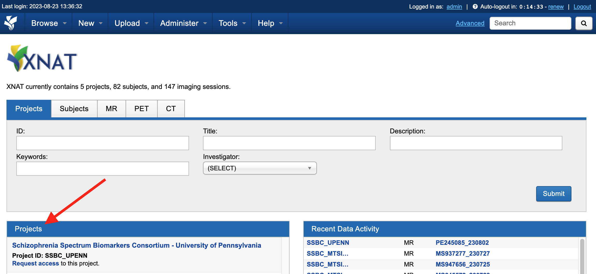
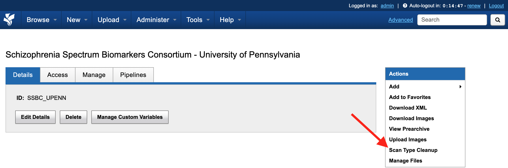
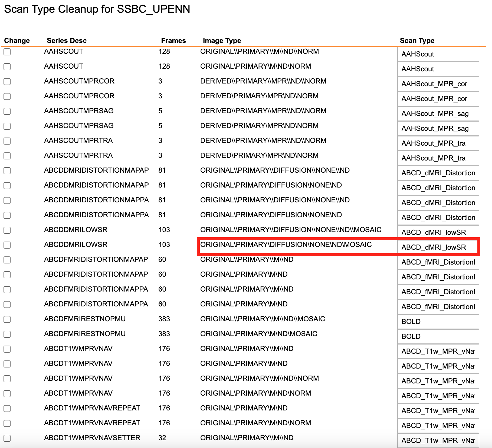
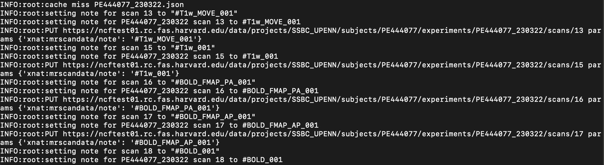
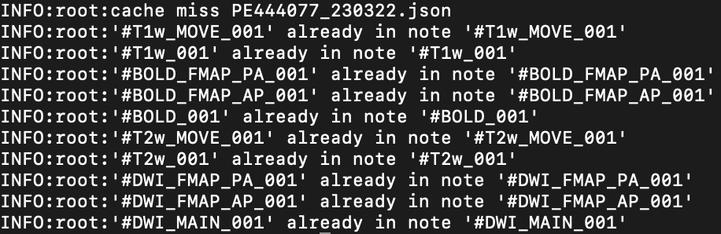

xnattagger Documentation
=========================

*xnattagger* is a python command line tool that labels or "tags" scans within an XNAT instance according to user specifications. 

Tagging Convention Overview
---------------------------

"Tagging" refers to adding notes to your scans' notes field in XNAT. The example below shows the tag that will be added to the notes field for each of the different modalities using *xnattagger* along with some example series names for each modality.

=========== ================================  ==================================================
Type        Example series                    Note
=========== ================================  ==================================================
DWI         ``UKbioDiff_ABCDseq_ABCDdvs``     ``#DWI_MAIN_001, #DWI_MAIN_002, ..., #DWI_MAIN_N``
DWI_PA_FMAP ``UKbioDiff_ABCDseq_DistMap_PA``  ``#DWI_PA_001, #DWI_PA_002, ..., #DWI_PA_N``
DWI_AP_FMAP ``UKbioDiff_ABCDseq_DistMap_AP``  ``#DWI_AP_001, #DWI_AP_002, ..., #DWI_AP_N``
BOLD        ``ABCD_fMRI_rest_noPMU``          ``#BOLD_001, #BOLD_002, ..., #BOLD_N``
BOLD_PA     ``ABCD_fMRI_DistortionMap_PA``    ``#BOLD_PA_001, #BOLD_PA_002, ..., #BOLD_PA_N``
BOLD_AP     ``ABCD_fMRI_DistortionMap_AP``    ``#BOLD_AP_001, #BOLD_AP_002, ..., #BOLD_AP_N``
T1w         ``ABCD_T1w_MPR_vNav``             ``#T1w_001, #T1w_001, ..., #T1w_N``
T1w_MOVE    ``ABCD_T1w_MPR_vNav_setter``      ``#T1w_MOVE_001, #T1w_MOVE_002, ..., #T1w_MOVE_N``
T2w         ``ABCD_T2w_SPC_vNav``             ``#T2w_001, #T2w_002, ..., #T2w_N``
T2w_MOVE    ``ABCD_T2w_SPC_vNav_setter``      ``#T2w_MOVE_001, #T2w_MOVE_002, ..., #T2w_MOVE_N``
=========== ================================  ==================================================

The image below displays an MR Session report page with populated notes.

.. note::
   Note that if a ``DWI`` scan has corresponding ``PA`` and ``AP`` scans, they should be assigned matching numbers. For example, ``#DWI_MAIN_001`` would correspond to ``#DWI_PA_001`` and ``#DWI_AP_001``.

.. image:: images/xnat-scan-notes.png

Installation
------------

Install *xnattagger* via pip:

.. code-block:: shell

    pip install xnattagger

Verify that it installed sucessfully:

.. code-block:: shell

	pip show xnattagger

Configuring xnattagger
----------------------

tagger.yaml file
^^^^^^^^^^^^^^^^

In order for *xnattagger* to work properly, it has to know what it's looking for as it parses information about the scans. Particularly, it needs to know the series name and image type that correspond to the different scans and modalities. That's where the *tagger.yaml* config file comes in. Take a look at the example below (`download <https://github.com/harvard-nrg/xnattagger/blob/main/tagger.yaml>`_). Notice that each modality has a series description, image type and tag associated with it.

.. note::
	Each modality/scan type can have several *series_description* and *image_type* fields that it tries to match to. In the example below, all three of the diffusion scan types have two sets of *series_description* and *image_type* fields. This means that *xnattagger* will tag diffusion scans that match **either** of those descriptions/scan types. If you have different series descriptions across projects/sites, you can catch and tag them all this way. The *tag* field is completely customizable. Whatever you put there will be inserted into the notes field on XNAT.

.. code-block:: yaml

  t1w:
      - series_description: ABCD_T1w_MPR_vNav
        image_type: [ORIGINAL, PRIMARY, M, ND, NORM]
        tag: 'T1w'
  t1w_move:
      - series_description: ABCD_T1w_MPR_vNav_setter
        image_type: [ORIGINAL, PRIMARY, M, ND, MOSAIC]
        tag: 'T1w_MOVE'
  t2w:
      - series_description: ABCD_T2w_SPC_vNav
        image_type: [ORIGINAL, PRIMARY, M, ND, NORM]
        tag: 'T2w'
  t2w_move:
      - series_description: ABCD_T2w_SPC_vNav_setter
        image_type: [ORIGINAL, PRIMARY, M, ND, MOSAIC]
        tag: 'T2w_MOVE'
  dwi:
      - series_description: ABCD_dMRI_lowSR
        image_type: [ORIGINAL, PRIMARY, DIFFUSION, NONE, ND, MOSAIC]
        tag: '#DWI_MAIN'
      - series_description: UKbioDiff_ABCDseq_ABCDdvs
        image_type: [ORIGINAL, PRIMARY, DIFFUSION, NONE, ND, MOSAIC]
        tag: '#DWI_MAIN'
  dwi_PA:
      - series_description: ABCD_dMRI_DistortionMap_PA
        image_type: [ORIGINAL, PRIMARY, DIFFUSION, NONE, ND]
        tag: '#DWI_FMAP_PA'
      - series_description: UKbioDiff_ABCDseq_DistMap_PA
        image_type: [ORIGINAL, PRIMARY, DIFFUSION, NONE, ND]
        tag: '#DWI_FMAP_PA'
  dwi_AP:
      - series_description: ABCD_dMRI_DistortionMap_AP
        image_type: [ORIGINAL, PRIMARY, DIFFUSION, NONE, ND]
        tag: '#DWI_FMAP_AP'
      - series_description: UKbioDiff_ABCDseq_DistMap_AP
        image_type: [ORIGINAL, PRIMARY, DIFFUSION, NONE, ND]
        tag: '#DWI_FMAP_AP'
  bold:
      - series_description: ABCD_fMRI_rest_noPMU
        image_type: [ORIGINAL, PRIMARY, M, ND, MOSAIC]
        tag: '#BOLD'
  bold_PA:
      - series_description: ABCD_fMRI_DistortionMap_PA
        image_type: [ORIGINAL, PRIMARY, M, ND]
        tag: '#BOLD_FMAP_PA'
  bold_AP:
      - series_description: ABCD_fMRI_DistortionMap_AP
        image_type: [ORIGINAL, PRIMARY, M, ND]
        tag: '#BOLD_FMAP_AP'

XNAT Scan Type
^^^^^^^^^^^^^^

You can find the series description and image type information in your XNAT instance. 

| 1. Start by clicking on a project on your XNAT instance homepage.

| 2. Click on *Scan Type Cleanup* on the right side of the page.

| 3. You will see a page that lists all of the series descriptions and image types that exist within the project. You will need to pull the information from here to populate your *tagger.yaml* file. 

Let's look at the diffusion acquisition as an example. Notice that the *series_description* in the *tagger.yaml* file above matches the *Scan Type* column in XNAT and the *image_type* in *tagger.yaml* matches the *Image Type* in XNAT. Be sure to follow the same tokenizing convention when copying the *Image Type* from XNAT to the *image_type* in *tagger.yaml*. The "\\" should be replaced with a comma and a space. Here is how we would convert the information form XNAT to yaml format using our diffusion example:

============================================================== ================================================================
XNAT                                                           tagger.yaml   
============================================================== ================================================================  
**Scan Type**: ABCD_dMRI_lowSR                                 **series_description**: ABCD_dMRI_lowSR
**Image Type**: ORIGINAL\\PRIMARY\\DIFFUSION\\NONE\\ND\\MOSAIC **image_type**: [ORIGINAL, PRIMARY, DIFFUSION, NONE, ND, MOSAIC]
============================================================== ================================================================

Follow the same convention for all your modalities and you will be good to go!

Running xnattagger
------------------

Required Arguments
^^^^^^^^^^^^^^^^^^

*xnattagger* requires three arguments: `1) ---label` `2) ---target-modality` `3) ---xnat-alias` `4) ---config`

| 1. ``--label`` refers to the XNAT MR Session ID, which is found under XNAT PROJECT ---> SUBJECT ---> MR_SESSION

.. image:: images/MR-Session.png

| 2. ``--target-modality`` refers to which modalities you want to tag. This argument may be **one** of the following: ``dwi``, ``t1``, ``t2``, ``bold``, ``all``

.. code-block:: shell

	--target-modality {dwi, t1, t2, bold, all}

| 3. ``--xnat-alias`` is the alias containing credentials associated with your XNAT instance. It can be created in a few `steps <https://yaxil.readthedocs.io/en/latest/xnat_auth.html>`_ with yaxil.

| 4. ``--config`` is the **absolute** path to the *tagger.yaml* file you created, or downloaded, above. 

Executing the Command
^^^^^^^^^^^^^^^^^^^^^

Command Template:

.. code-block:: shell

    xnat_tagger.py --label <MR_SESSION> target-modality <MODALITY> --xnat-alias <ALIAS> --config <PATH_TO_CONFIG_FILE>

Command Example:

.. code-block:: shell

    xnat_tagger.py --label PE201222_230719 --target-modality all --xnat-alias ssbc --config /home/nrg/tagger.yaml

Expected Output
^^^^^^^^^^^^^^^

Your terminal output should look something like this:

If your tag already exists in the notes field on XNAT, you'll get a terminal message that looks something like this:

Common Errors
^^^^^^^^^^^^^

Many errors tend to stem from mis-formatting the tagger.yaml file. Learn about `yaml here <https://www.youtube.com/watch?v=9BGWtTahGnw>`_. Follow the example given above closely!

Advanced Usage
^^^^^^^^^^^^^^

If you would like to see what tags will be uploaded to XNAT without actually doing it, pass the ``--dry-run`` argument. You will also have to specify an output json file: ``-o test.json``. That json file will contain metadata about the tags *xnattagger* mode **would** upsert. This can be useful for testing/debugging.

All Arguments
^^^^^^^^^^^^^
===================== ========================================  ========
Argument              Description                               Required
===================== ========================================  ========
``--label``           XNAT Session Label                        Yes
``--target-modality`` Modality to tag                           Yes
``--xnat-alias``      Alias for XNAT Project                    Yes
``--config``          Configuration file for tagging scans      Yes
``--project``         Project Name                              No
``--confirm``         User confirms each tag                    No
``--dry-run``         Generate list of to-be-downloaded scans   No
``-o``                Path to ``--dry-run`` json output file    No
===================== ========================================  ========

Scripting for *xnattagger*
^^^^^^^^^^^^^^^^^^^^^^^^^^

You can tag scans for all the subjects and projects in your XNAT instance through a combination of yaxil, *xnattagger* and the XNAT REST API. The example below (written in python) assumes that you've created an *xnat alias* (auth in the example) using yaxil and that your instance has three projects named: Michigan, Kansas and UCSD

.. code-block:: python

	import yaxil
	import subprocess

	projects = ["Michigan", "Kansas", "UCSD"]
	
	with yaxil.session(auth) as sess:
		for project in projects:
			for subject in sess.subjects(project=project):
				for experiment in sess.experiments(subject=subject):
					tagger = f'xnat_tagger.py --alias example --config /home/nrg/tagging.yaml --target-modality all --label {experiment}'
					proc1 = subprocess.Popen(tagger, shell=True, stdout=subprocess.PIPE)
					proc1.communicate()

And that's it! Contact *info@neuroinfo.org* with any questions or suggestions.
