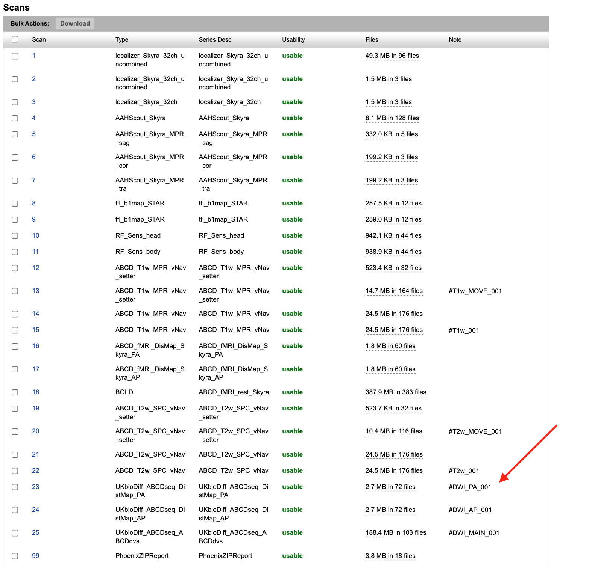
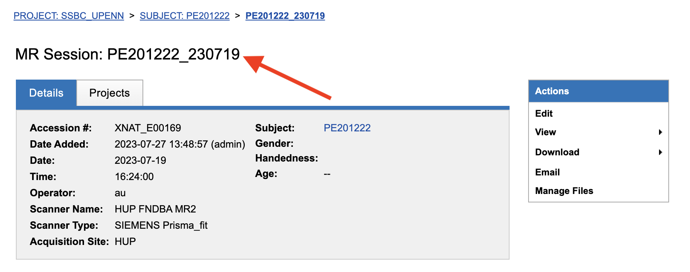

xnattagger Documentation
=========================

*xnattagger* is a python command line tool that labels or "tags" scans within an XNAT instance according to user specifications. 

Tagging Convention Overview
---------------------------

"Tagging" refers to adding notes to your scans' notes field in XNAT. The example below shows the tag that will be added to the notes field for each of the different modalities using *xnattagger* along with some example series names for each modality.

=========== ================================  ==================================================
Type        Example series                    Note
=========== ================================  ==================================================
DWI         ``UKbioDiff_ABCDseq_ABCDdvs``     ``#DWI_MAIN_001, #DWI_MAIN_002, ..., #DWI_MAIN_N``
DWI_PA_FMAP ``UKbioDiff_ABCDseq_DistMap_PA``  ``#DWI_PA_001, #DWI_PA_002, ..., #DWI_PA_N``
DWI_AP_FMAP ``UKbioDiff_ABCDseq_DistMap_AP``  ``#DWI_AP_001, #DWI_AP_002, ..., #DWI_AP_N``
BOLD        ``ABCD_fMRI_rest_noPMU``          ``#BOLD_001, #BOLD_002, ..., #BOLD_N``
BOLD_PA     ``ABCD_fMRI_DistortionMap_PA``    ``#BOLD_PA_001, #BOLD_PA_002, ..., #BOLD_PA_N``
BOLD_AP     ``ABCD_fMRI_DistortionMap_AP``    ``#BOLD_AP_001, #BOLD_AP_002, ..., #BOLD_AP_N``
T1w         ``ABCD_T1w_MPR_vNav``             ``#T1w_001, #T1w_001, ..., #T1w_N``
T1w_MOVE    ``ABCD_T1w_MPR_vNav_setter``      ``#T1w_MOVE_001, #T1w_MOVE_002, ..., #T1w_MOVE_N``
T2w         ``ABCD_T2w_SPC_vNav``             ``#T2w_001, #T2w_002, ..., #T2w_N``
T2w_MOVE    ``ABCD_T2w_SPC_vNav_setter``      ``#T2w_MOVE_001, #T2w_MOVE_002, ..., #T2w_MOVE_N``
=========== ================================  ==================================================

The image below displays an MR Session report page with populated notes.

.. note::
   Note that if a ``DWI`` scan has corresponding ``PA`` and ``AP`` scans, they should be assigned matching numbers. For example, ``#DWI_MAIN_001`` would correspond to ``#DWI_PA_001`` and ``#DWI_AP_001``.

Installation
------------

Install *xnattagger* via pip:

.. code-block:: shell

    pip install xnattagger

Verify that it installed sucessfully:

.. code-block:: shell

	pip show xnattagger

Configuring xnattagger
----------------------

tagger.yaml file
^^^^^^^^^^^^^^^^

In order for *xnattagger* to work properly, it has to know what it's looking for as it parses information about the scans. Particularly, it needs to know the series name and image type that correspond to the different scans and modalities. That's where the *tagger.yaml* config file comes in. Take a look at the example below. Notice that each modality has a series description and image type associated with it.

.. note::
	Each modality/scan time can have several *series_description* and *image_type* fields that it tries to match to. In the example below, all three of the diffusion scan types have two sets of *series_description* and *image_type* fields. This means that *xnattagger* will match to diffusion scans that match **either** of those descriptions/scan types. If you have different series descriptions across projects/sites, you can catch and tag them all this way.

.. code-block:: yaml

	t1w:
	    - series_description: ABCD_T1w_MPR_vNav
	      image_type: [ORIGINAL, PRIMARY, M, ND, NORM]
	t1w_move:
	    - series_description: ABCD_T1w_MPR_vNav_setter
	      image_type: [ORIGINAL, PRIMARY, M, ND, MOSAIC]
	t2w:
	    - series_description: ABCD_T2w_SPC_vNav
	      image_type: [ORIGINAL, PRIMARY, M, ND, NORM]
	t2w_move:
	    - series_description: ABCD_T2w_SPC_vNav_setter
	      image_type: [ORIGINAL, PRIMARY, M, ND, MOSAIC]
	dwi:
	    - series_description: ABCD_dMRI_lowSR
	      image_type: [ORIGINAL, PRIMARY, DIFFUSION, NONE, ND, MOSAIC]
	    - series_description: UKbioDiff_ABCDseq_ABCDdvs
	      image_type: [ORIGINAL, PRIMARY, DIFFUSION, NONE, ND, MOSAIC]
	dwi_PA:
	    - series_description: ABCD_dMRI_DistortionMap_PA
	      image_type: [ORIGINAL, PRIMARY, DIFFUSION, NONE, ND]
	    - series_description: UKbioDiff_ABCDseq_DistMap_PA
	      image_type: [ORIGINAL, PRIMARY, DIFFUSION, NONE, ND]
	dwi_AP:
	    - series_description: ABCD_dMRI_DistortionMap_AP
	      image_type: [ORIGINAL, PRIMARY, DIFFUSION, NONE, ND]
	    - series_description: UKbioDiff_ABCDseq_DistMap_AP
	      image_type: [ORIGINAL, PRIMARY, DIFFUSION, NONE, ND]
	bold:
	    - series_description: ABCD_fMRI_rest_noPMU
	      image_type: [ORIGINAL, PRIMARY, M, ND, MOSAIC]
	bold_PA:
	    - series_description: ABCD_fMRI_DistortionMap_PA
	      image_type: [ORIGINAL, PRIMARY, M, ND]
	bold_AP:
	    - series_description: ABCD_fMRI_DistortionMap_AP
	      image_type: [ORIGINAL, PRIMARY, M, ND]

XNAT Scan Type
^^^^^^^^^^^^^^

You can find the series description and image type information in your XNAT instance. 

| 1. Start by clicking on a project on your XNAT instance homepage.

| 2. Click on *Scan Type Cleanup* on the right side of the page.

| 3. You will see a page that lists all of the series descriptions and image types that exist within the project. You will need to pull the information from here to populate your *tagger.yaml* file. 

Let's look at the diffusion acquisition as an example. Notice that the *series_description* in the *tagger.yaml* file above matches the *Scan Type* column in XNAT and the *image_type* in *tagger.yaml* matches the *Image Type* in XNAT. Be sure to follow the same tokenizing convention when copying the *Image Type* from XNAT to the *image_type* in *tagger.yaml*. The "\\" should be replaced with a comma and a space. Here is how we would convert the information form XNAT to yaml format using our diffusion example:

============================================================== ================================================
XNAT                                                           tagger.yaml   
============================================================== ================================================  
**Scan Type**: ABCD_dMRI_lowSR                                 **series_description**: ABCD_dMRI_lowSR
**Image Type**: ORIGINAL\\PRIMARY\\DIFFUSION\\NONE\\ND\\MOSAIC **image_type**: [ORIGINAL, PRIMARY, DIFFUSION, NONE, ND, MOSAIC]
============================================================== ================================================

Follow the same convention for all your modalities and you will be good to go!

Running xnattagger
------------------

Required Arguments
^^^^^^^^^^^^^^^^^^

*xnattagger* requires three arguments: `1) ---label` `2) ---target-modality` `3) ---xnat-alias`

| 1. ``--label`` refers to the XNAT MR Session ID, which is found under XNAT PROJECT ---> SUBJECT ---> MR_SESSION

| 2. ``--target-modality`` refers to which modalities you want to tag. This argument may be **one** of the following: ``dwi``, ``anat``, ``bold``, ``all``

.. code-block:: shell

	--target modality {dwi, anat, bold, all}

| 3. ``--xnat-alias`` is the alias containing credentials associated with your XNAT instance. It can be created in a few `steps <https://yaxil.readthedocs.io/en/latest/xnat_auth.html>`_ with yaxil.

